**Table of Contents**

- [Chapter 6: Physics](#Chapter 6: Physics)
	- [What Is Physics?](#What Is Physics?)
	- [Overview](#Overview)
	- [World Properties](#World Properties)
	- [Physics Engine](#Physics Engine)
		- [Hands-on: World Settings for Multiple Scenes](#Hands-on: World Settings for Multiple Scenes)
	- [Culling Resolution](#Culling Resolution)
	- [Physics Substeps](#Physics Substeps)
	- [On the Issue of Time](#On the Issue of Time)
	- [Physics Steps](#Physics Steps)
	- [Logic Steps](#Logic Steps)
	- [FPS](#FPS)
	- [Physics Deactivation](#Physics Deactivation)
	- [Physics Panel Settings](#Physics Panel Settings)
	- [Physics Types](#Physics Types)
		- [No Collision](#No Collision)
		- [Static](#Static)
		- [Dynamic](#Dynamic)
		- [Rigid Body](#Rigid Body)
		- [Soft Body](#Soft Body)
		- [Occluder](#Occluder)
		- [Sensor](#Sensor)
		- [Navigation Mesh](#Navigation Mesh)
			- [Hands-on Tutorial: Navigation](#Hands-on Tutorial: Navigation)
		- [Characters](#Characters)
	- [Common Settings](#Common Settings)
		- [Hands-on Tutorial: Creating Compound Objects](#Hands-on Tutorial: Creating Compound Objects)
	- [Material Panel Physics Settings](#Material Panel Physics Settings)
		- [Hands-on Tutorial: Force Field Water Surface](#Hands-on Tutorial: Force Field Water Surface)
	- [Constraints](#Constraints)
	- [Vehicle Physics](#Vehicle Physics)
		- [Hands-on Tutorial: Vehicle Physics Using Python](#Hands-on Tutorial: Vehicle Physics Using Python)
	- [Game Settings](#Game Settings)
	- [Stabilizing Physics](#Stabilizing Physics)

# Chapter 6: Physics 

Welcome to Physics 101! We are going to be your professors for this chapter. Follow along as we dive into a dynamic world of falling apples, run alongside bouncing balls, and soar with flying spaghetti (see Figure 6.1).

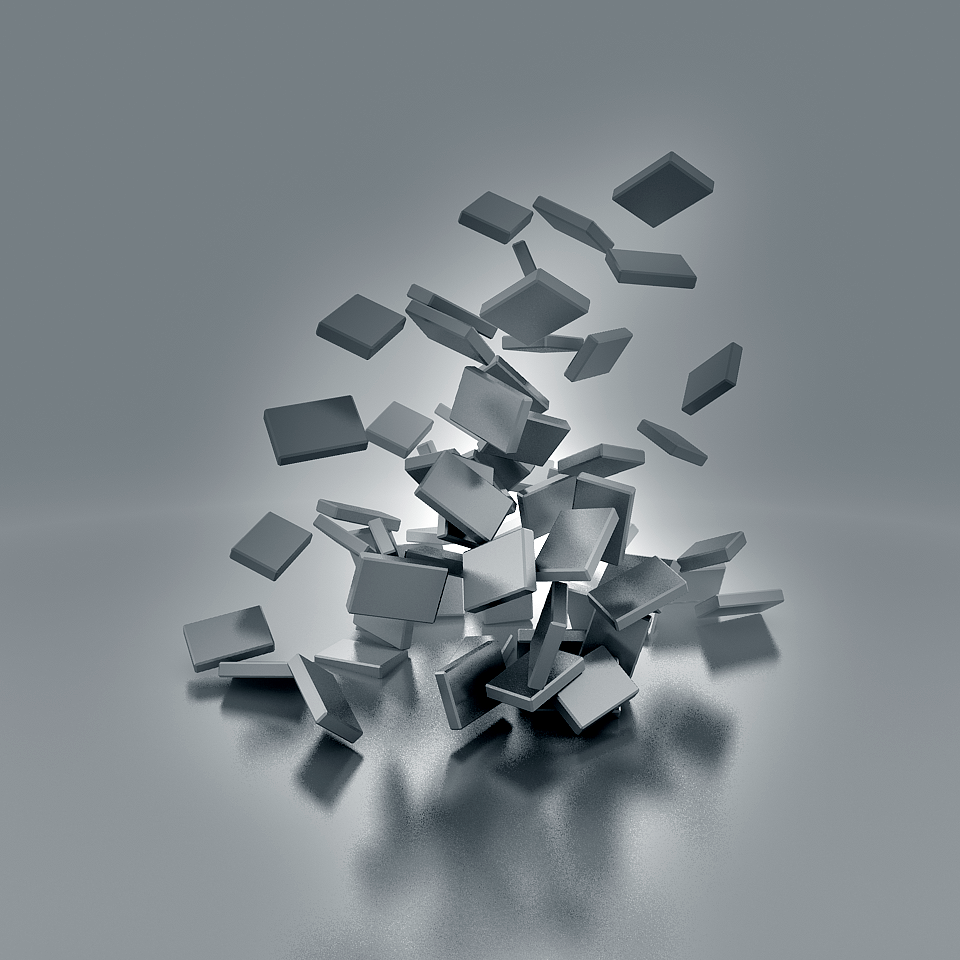

## What Is Physics?

In the real world, the laws of physics govern everything from the smallest subatomic particle to the largest galaxy far, far away. Luckily for us, we don't have to understand quantum mechanics, Newtonian physics, or Euclidean space in order to make a fun game. A physics engine handles game events such as collision detection between objects, moves objects in a physically realistic way, and even deforms objects as if they are made up of a soft material.

A physics engine moves things based on a set of predefined rules so that you, the artist, don't have to manually animate every object interaction. Compared to traditional keyframe animations, which are premade, the dynamic nature of the physics engine means that it is inherently non-deterministic[md]the motion of the object depends on the physical property of the object and its state in the physical world. This unique property makes games that utilize real-time physics fun to play around with, if not unpredictable sometimes.

As usual, this chapter comes with a collection of example files that showcase what the physics engine can do. You can find them in the folder /chapters6/demos.

## Overview

Because physics is such an integral part of the Blender game engine, physics-related settings are found in many different places. However scattered they might look at first glance, there is a pattern in this chaos.

The physics settings can be broken down into these sections:

**       ** [lb] **        World settings:** Contain settings that affect the entire scene. Global settings such as gravity strength can be found here. Figure 6.2 shows the World Properties Editor.

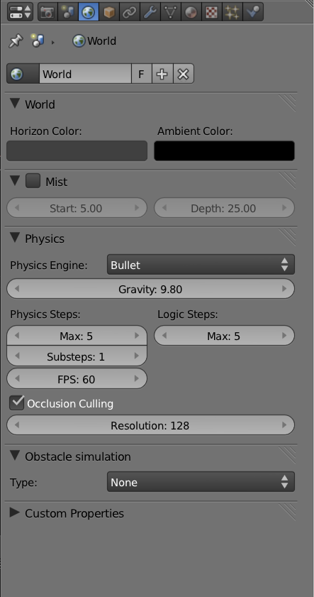

**       ** [lb] **        Object Physics settings:** Any game-engine object (mesh, lamp, camera, empty, and text) can be turned into a physical object. Once physics is enabled for an object, it starts obeying the rules of the physics engine, transforming the object from a static object into something that falls, collides, tumbles, and deforms. Figure 6.3 shows the Physics Properties Editor.

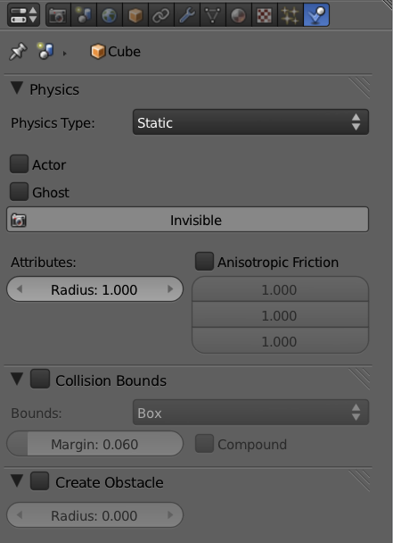

[lb] **Material Physics settings:** The Material panel is not only a place where all the graphic magic happens; it also contains additional physics that control how the surface of the object behaves. Settings such as surface friction can be found here. Because an object can have multiple materials, material physics settings allow the artist to assign different surface materials for different parts of a single object. Figure 6.4 shows the Material Properties Editor.

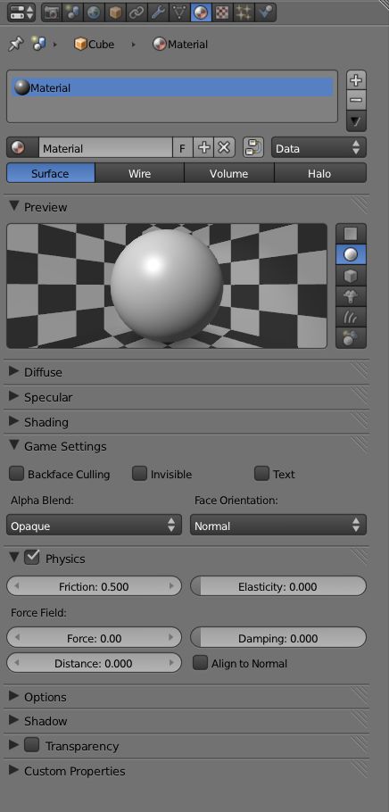

**        [**lb] **        Object constraints:** When you were young, your parents probably set out certain rules that you needed to abide by. If any of the rules were broken, bad things happened. Physics constraints work in roughly the same way (without all the drama and door slamming). They allow you to set up simple rules that the objects follow, rules such as tracking one object to another or limiting their range of motion. With constraints, it's possible to realistically represent many of the structures that have a limited degree of motion, such as hinges, wheels, and chains. Figure 6.5 shows the Object Constraints Properties Editor.

[lb] **Physics sensors and actuators:** Except for maybe the case of a Rube Goldberg machine, where everything happens in a predetermined manner, most games would be pretty boring if there were no way to make an object move at a user's command or to trigger a reaction when two objects collide. Actuators and sensors fulfill these two roles, respectively. Actuators are part of logic brick that carries out an action (such as applying a force to the object to make it move). Sensors are triggers that detect when something happens in the game, such as when two objects touch. A combination of sensors and actuators makes a game truly interactive, by giving the game engine the ability to make decisions. Figure 6.6 shows the Logic Brick Editor. In case you forgot, Chapter 3 is all about logic bricks.

**       ** [lb] **        Python:** In addition to all the physics settings one can access from the graphic user interface, an extensive Python API is at your disposal. The Python API gives you programmable control over many aspects of the physics engine. With Python, you can dynamically set many of the physics options while the game is running. It even allows you to accomplish a few things that are not possible from the graphic interface. For instance, Python can be used to create realistic vehicle physics. Figure 6.7 shows the Text Editor with a Python script open.

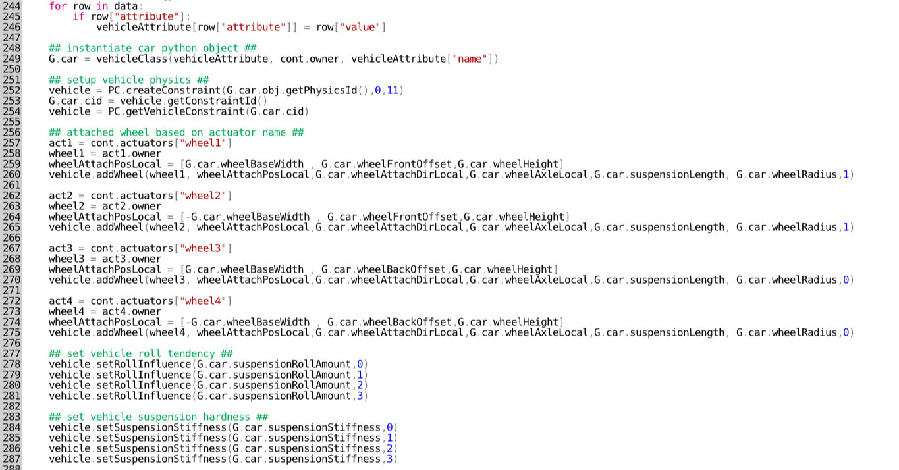

So now that you have an overview of what physics is all about and where to find all the settings, the rest of the chapter will explain how to use these settings in combination to achieve various effects.

## World Properties

World Properties Editor is generally the first place to visit when setting up physics, simply because the settings here are truly global: they affect the entire scene.

In the World Properties Editor, there are numerous global physics settings that affect how the scene behaves. Again, remember that game-specific settings are only visible when the engine selector is set to Blender Game, as shown in Figure 6.8.

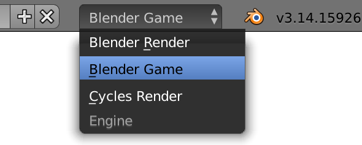

## Physics Engine

Under the Physics section of the World Properties Editor, you are presented with a choice to select a physics engine. A physics engine is the underlying computer algorithm that drives all physics simulation. Blender uses Bullet Physics, which is a powerful and open-source physics library developed by Erwin Coumans and others. Not only is Bullet used in Blender, but it is also used by other commercial games, as well as movie productions, as part of the visual effects pipeline.

When the engine selector is set to none, all physics calculation is disabled. Dynamic objects will not move when a force is applied, and collisions will not be detected. Most games will use some degree of physics, so keep physics turned on unless you are absolutely sure you don't need it. If you choose to disable physics, the majority of the features mentioned in the rest of this chapter will not work.

Figure 6.9 shows the World Physics settings.

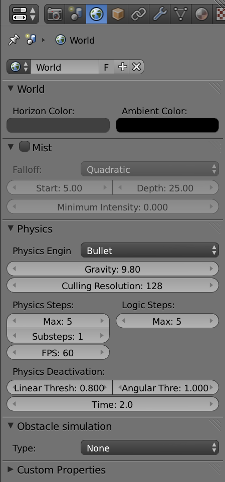

\*\*\* Begin Note

Disabling Physics

Some functions that seem to be unrelated to the physics engine, such as the raycast and mouseover sensors, also use the physics engine to detect objects. Therefore, disabling physics will break these functions as well.

\*\*\* End Note

With the physics engine set to Bullet, you can set the world gravity value. The higher the number, the faster an object falls. The default value of 9.8 corresponds to acceleration due to gravity on earth; for comparison, Mars has a gravity of 3.7 m/s².

\*\*\* Begin Note

World and Scene Gravity Settings

There are two separate gravity settings in Blender. One in the World panel[md]which controls gravity for the game physics, and one in the Scene panel[md]which controls gravity for the non-game aspect of Blender physics (fluid, particles, and smoke simulation). They are only visible in their respective engines (Blender Game and Blender Render or Cycles Render, respectively).When working with games, make sure you adjust the right setting under World.

\*\*\* End Note

### Hands-on: World Settings for Multiple Scenes

Because Blender supports multiple scenes and each scene can have its own World data block, the physics settings can be set independently per scene. This means it is possible to create multiple worlds (or _levels_, as they are commonly called in games), each with different physics settings, all contained within one Blender file. For example, one could create a game with two scenes, one taking place on earth and another taking place on Mars. By altering world settings such as sky color, mist depth, and the gravity strength for each scene, you can easily convey the idea of a foreign planet.

To create a game with two scenes:

1.Open /Book/Chapter6/earthMars.blend. When the game is running, you are in control of a first-person-shooter style camera, which can be moved with the W, A, S, and D keys and rotated with the mouse. Cubes are generated out of thin air and they fall to the ground according to gravity.

2.First, rename the default scene from "Scene" to something more descriptive, such as "Earth," by clicking on the Scene data block and typing in a new name, as shown in Figure 6.10.

3.Go to the World Properties Editor; set the Horizon color to a light blue, as shown in Figure 6.11. This way, you can easily tell which scene is which.

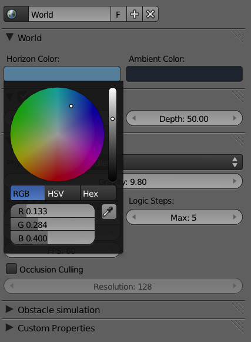

4.To make another world, you create a copy of Earth scene by clicking on the + sign beside the scene browser. From the drop-down list, select Full Copy, as shown in Figure 6.12. This will be the scene for your second world.

5.Rename the new scene you just created from "Earth.001" to "Mars."

6.Go to the World Properties Editor; set the Horizon color to a dark orange (see Figure 6.13).

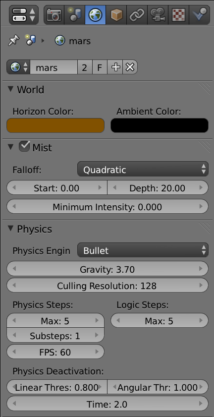

7.Lower the gravity from 9.8 to 3.7, which is the gravity on Mars.

8.To toggle between the two scenes, you need to add a simple logic brick to both of your scenes, so that when the spacebar is pressed in the Earth scene, it will jump to the Mars scene, and vice versa. Set up the logic brick as shown in Figure 6.14. In this case, it doesn't matter which object the logic brick is attached to because the action it carries out is global. The camera is used in our example to host the logic brick.

9.Recreate the logic brick in the other scene as well. Set it to load the corresponding scene.

10.Now press P to play the game. Jump between the two scenes using the spacebar. Notice that the gravity and the sky color changes depending on which scene you are on.

11.That's it! The finished game can be found under the name earthMars-finished.blend. To extend this game, you can play around with the physics properties of the cube, which is hidden in layer 2.

## Culling Resolution

Occlusion culling skips the rendering of objects that are out of view or behind an Occluder object. By not drawing these objects, you can speed up the display performance of the game. Occlusion culling used to be an option that could be turned off by the user, but in the most recent versions, occlusion culling is always turned on.

Occluder objects must be manually defined. For more information on how to set up occlusion culling, refer to Chapter 8, "Workflow and Optimization."

The culling resolution setting controls how fine the occlusion test is. Higher value leads to slower performance, but it gives more accurate culling of smaller objects that might otherwise be missed by a low-resolution occlusion buffer. The default value of 128 is optimum for most cases.

\*\*\* Begin Note

Not Visible but Still There

Occlusion culling only skips the display of an object. The object would still be processed by the logic and physics engine. So any physical interaction, logic brick setup, or Python script attached to the object will run as usual even when the object is culled from the display.

\*\*\* End Note

## Physics Substeps

The Physics Steps and Logic Steps are two settings that control the behavior of the physics engine. They are considered advanced tweaks that generally should not be tinkered with. And even if you do, the effect might not be obvious at first. This section tries to demystify those settings. Refer to Figure 6.15 as you follow along.

When physics simulation is not accurate enough, you might see objects going through each other, especially when objects are moving very fast relative to each other. To increase the accuracy of the physics simulation, you can force Blender to break down the physics simulation into a smaller slice of time. You do so by increasing the value of the subset in the interface. Essentially, a substep accounts for the number of physics iterations we have per frame. So 1 substep stands for one interaction per frame, 2 substeps is two iterations (this twice the physics calculations), etc. A higher number makes the physics simulation run with better accuracy, at the cost of a dramatic decrease in performance for physics-heavy scenes.

If you run into any physical instability, you might be tempted to immediately raise the substep value. Avoid this impulse: do not rely entirely on substeps to hide a badly designed physics setup; the physics engine is designed to run with a substep of 1 or 2. Use other ways to stabilize the physics as described later in the chapter. Only raise the substep value when all else fails.

\*\*\* Begin Note

Bottom Line

Generally speaking, a value of 1 is sufficient for slow-moving games; 2 is optimum for fast-moving arcade games and action games with lots of physics interactions; driving games might require a 3 or a 4 (well, depending on how fast the car can go); do not use 5 unless your game contains supersonic objects.

\*\*\* End Note

## On the Issue of Time

For the following discussion, the word _realworld-time_ refers to the flow of time in the real world, the world that we live in. Relativistic physics aside, real time is always constant for our purpose. There are no magic devices, fabled incantations, or speeding DeLoreans to alter the flow of time.

The term _game-time_ refers to the flow of time in the virtual game world. The flow of game-time is generally constant as well, except for special cases where slow motion or time lapse is used.

Why is this important? For most games, the game-time should be directly proportional to the realworld-time and completely independent of the frame rate. So that no matter how high or low the frame rate is, the game-time will always flow at a constant rate. Having the game-time independent of the frame rate has many benefits. A game that runs on a constant game-time does not slow down when the frame rate is low, nor does it speed up when the frame rate is high. This is to ensure that people with different computers can enjoy the game at the same speed. You wouldn't want to play a driving game that makes the car go faster on a fast computer but slows down to a crawl on a slow computer!

It turns out that ensuring a constant game-time despite fluctuations in the frame rate is hard! The following few settings are used to control how the game-time is tied together with the frame rate.

## Physics Steps

The Max Physics Steps control how many consecutive physical simulation frames the game engine is allowed to run for each rendered frame. A high value (5) is more physically accurate, because it gives the physics engine enough time to complete the physics calculation, regardless of the game frame rate, therefore yielding a more consistent game-time that is independent of the frame rate, at the cost of taking up more processing time. A low value (1) can increase the frame rate of the game slightly by reducing the number of consecutive physical simulation frames the game engine is allowed to run every frame, but at the cost of inaccurate physics behavior, because the game-time would be linked to the frame rate.

\*\*\* Begin Note

Bottom Line

If you are still confused, just set the Max Physics Steps to 5. This ensures that the game-time is as constant as possible, no matter what the frame rate is.

\*\*\* End Note

## Logic Steps

Very similar to the Max Physics Steps, the Max Logic Steps control how many consecutive game logic tics the game engine is allowed to run for each rendered frame. When the game frame rate is lower than the nominal FPS setting, a high value (5) is more accurate because it makes sure the logic step always gets enough time to finish all the logic computation. Conversely, a low value (1) will yield slightly better performance at the cost of a fluctuation in game-time. So this means that when the frame rate is high, the game will run normally, but if the frame rate drops, the game will appear to slow down.

\*\*\* Begin Note

Bottom Line

The default value of 5 means that the logic always gets enough time to run, no matter what frame rate the game runs at. This ensures that the game-time does not slow down when the frame rate is low.

\*\*\* End Note

## FPS

Frames per second is the Holy Grail of performance benchmarking. For a video game, a high frame rate is always desired because it means smoother action and faster response to user input. Frame rate is a function of the complexity of the scene and the speed of the computer. Unfortunately, the setting here only acts as a frame rate cap, not the actual frame rate the game is guaranteed to run at. The default value of 60fps means that each second, the game engine evaluates the game logic 60 times. This particular number is chosen since most LCD monitors do not refresh faster than 60Hz, so, any extra frame rendered by the computer will just be wasted.

Internally, fps sets the number of logic tics and physics tics the game engine runs at. So as you lower the fps setting, the number of logic and physics tics performed by the game will decrease accordingly. This has the effect of slowing down the game-time_._ In another word, if the fps is set too low, not only will the game feel choppy, but it will actually appear as if it's running in slow motion.

\*\*\* Begin Note

Bottom Line

The default value of 60 is good for most game applications. Setting this value higher does not give you better performance. It is also customary for some games to set the fps to a lower value such as 30. The idea is that a game running at a constant 30fps feels smoother than a game that is fluctuating between 30fps and 60fps. Additionally, you can set vsync in your graphic card to force a frame rate ceiling. You don't have control over that in the player's computer, though.

\*\*\* End Note

## Physics Deactivation

The values Linear Threshold, Angular Threshold, and Time all control how aggressively the physics engine puts objects to "sleep" in order to reduce the load on the game.

Setting the deactivation time to 0 effectively disables this optimization. Since sleep can also be disabled per object from the Physics Properties Editor, it's generally not recommended to disable deactivation here.

Lower the Linear Threshold if an object comes to a stop earlier than expected.

Lower the Angular Threshold if an object comes to a stop from spinning earlier than expected.

## Physics Panel Settings

So now that you are familiar with the World Properties Editor, which contains settings that apply to all physical objects indiscriminately, let's take a look at the Physics Properties Editor. From here, you can alter the physical characteristics of individual objects.

Physics settings apply to all game objects types, including mesh, empty, lamp, and camera.

## Physics Types

How do you decide which physics type to pick for an object? That largely depends on the role of the object in the game. Table 6.1 shows all the physics types that are available in Blender and their corresponding characteristics.

\*\*\*Insert Table 6.1

Table 6.1

Physics Types

Type  Collision G,F,T  Roll Typical Use

No collision No  No  No Effects, high-resolution mesh

Static  Yes  No  No Buildings, immovable structures

Dynamic Yes  Yes  No None

Rigid Body Yes  Yes  Yes Movable barrels, crates, general objects

Soft Body Yes  Partial  Yes Hair, cloth, rubber ducky

Occluder No  No  No Walls for performance optimization

Sensor  Yes  No  No Event triggers

Navigation No  No  No Pathfinding helper

Character Yes  No  No Designed specifically for characters

Collision: Whether the object detects collision.

G,F,T: Whether the object can be moved by Gravity, Force, and Torque.

Roll: Whether the objects roll and tumble when they are on an incline.

[c] 2014 Dalai Felinto and Mike Pan.

\*\*\*End of Table

To familiarize yourself with the different physics types, open the demo file available from /Book/Chapter6/demo/physicsTypes.blend. It shows some of the common physics types and their behavior, as shown in Figure 6.15.

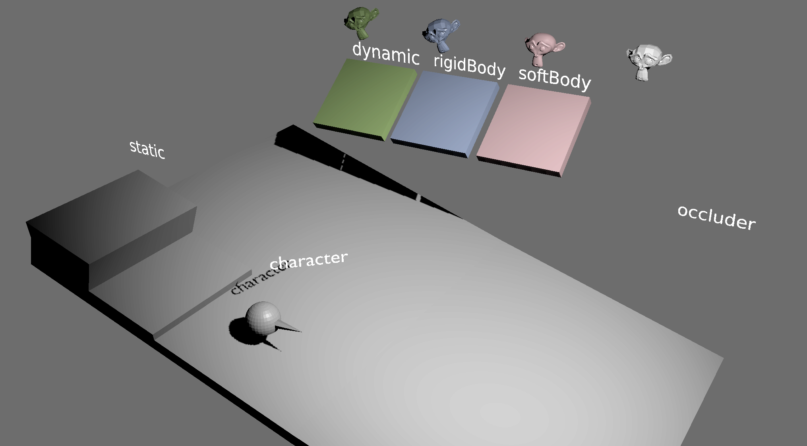

Let's look at the settings in more detail.

### No Collision

No Collision skips all physics calculation. The objects will be effectively invisible to the physics engine. Other objects will not be able to detect collision with the object, nor collide with it. No Collision objects can still be moved using the Motion actuator. Use this for objects that you don't intend to interact with at all during the game, such as leaves of vegetation.

\*\*\* Begin Note

Collision Proxy

Setting an object to No Collision completely skips collision detection on the object, which can speed up the game considerably on a high-polygon mesh. A common practice is to set the high-polygon mesh to No Collision and then manually create a simplified "collision proxy" mesh object that approximates the shape of the high-polygon mesh. Then attach the high-polygon mesh to the collision proxy using parenting. This way, the low-polygon mesh will be used for all collision calculation, which is fast, and a high-polygon version of the object will be used for display, which is visually nicer. As this is an optimization technique, a step-by-step tutorial on creating a collision proxy is covered in Chapter 8.

\*\*\* End Note

### Static

Static objects are the default physics type for objects. They do not fall due to gravity, nor do they move by external impact, such as another object striking them. By default, the mesh itself is used as the collision mesh, which can be slow if the object has a lot of polygons. Static objects never move on collision with another object. Use this setting for objects that require collision but don't move, such as buildings and fixed structures.

### Dynamic

Dynamic objects are different from static objects in that they have a defined mass and follow the basic Newtonian law of mass and acceleration. They fall due to gravity and react when another object collides with them. By default, the collision bound for dynamic objects is a sphere for performance reasons. Sometimes this is sufficient, but most of the time, it's better to use another shape as the collision bound. More on collision bounds in Chapter 8. Moreover, because dynamic objects do not roll, their usefulness is limited. If you want to simulate a realistic 3D object, Rigid Body is what you want.

### Rigid Body

Rigid body behaves very similarly to a dynamic object: they have a defined mass, accelerate due to gravity, and react to collisions. On top of that, rigid body objects have the ability to tumble when needed, whereas a dynamic object will slide awkwardly down a ramp without rotating.

If the Suzanne model in the aforementioned sample Blender file is set to Rigid Body, it will behave like a real object, fall toward the ground, and come to rest on one of its ears.

\*\*\* Begin Note

Avoid DLoc Movement

When using a dynamics based object (Dynamic, Rigid Body, and so on), you should use physics-based options, such as force and linear velocity for movement, and not change its location directly by dLoc.

\*\*\* End Note

### Soft Body

Whereas all the previously described physics types operate on the objects by moving and rotating them around without changing the underlying geometry, Soft Body physics uses a mass-spring system to apply deformations to the actual geometry. With Soft Body, you can create convincing cloth and other soft objects. Although it is very cool to play around with, Soft Body is very computationally intensive compared to the other physics types, and not as stable, so use it sparingly.

As seen in the Suzanne model in the sample file, it will fall due to gravity, and once it hits the ground, it collapses as if it's made of a rubber shell. This is the power of Soft Body physics.

\*\*\* Begin Note

Apply Scale

The physics engine works more reliably when the objects have a scale of 1. Thus, it is highly recommended to Apply Scale by pressing Ctrl+A on most of the objects before you run the game. This will prevent a lot of the strange issues that might crop up later.

\*\*\* End Note

### Occluder

Occluder objects do not react to gravity and collision. Their only function is to make any objects behind them invisible. Occluder objects are used to help the game engine decide when to remove objects from view to speed up the rendering performance. Strategically-placed occluders can significantly increase the performance of the game.

Figure 6.16 explains how occluders work.

From left to right, the first image shows the scene setup of /Book/Chapter6/PhysicsOccluder.blend. The second image shows what the camera sees. Notice the monkey head is not visible because the plane is blocking it. The third image is the view from the same camera while in-game, in wireframe mode. Notice that even though the monkey head is behind the wall, it is still being rendered, thus wasting precious computing time. The last image is the same in-game view as the previous image, but with the wall set to Occluder, the monkey head is not displayed.

### Sensor

Similar to Static Object, a Sensor object detects collision with another object. It is usually used as a replacement for the "radar" or "near" sensor because a Sensor object can be made into any arbitrary shape. Furthermore, Sensors will detect collisions, but they do not register a response. In other words, they behave like ghost objects. Additional logic bricks are needed to utilize a Sensor object effectively.

### Navigation Mesh

This setting turns an object into a helper object that is used for pathfinding navigation.

Since Blender 2.6, the game engine has a fully automated AI pathfinding routine. It can be used to direct an AI character through the 3D world, reaching a target, while avoiding obstacles.

\*\*\*Insert Tutorial

#### Hands-on Tutorial: Navigation

1.Open /Book/Chapter6/navigation.blend

2.This scene is set up with four objects (excluding the lamp and the camera).

3._Monkey_ is our main character; it will be navigating through the maze (the VisualMesh) to get to the Target. To aid its quest, we have created a simple helper geometry that outlines where the character can walk. This object is known as the _NavMesh_. Figure 6.17 shows the initial setup.

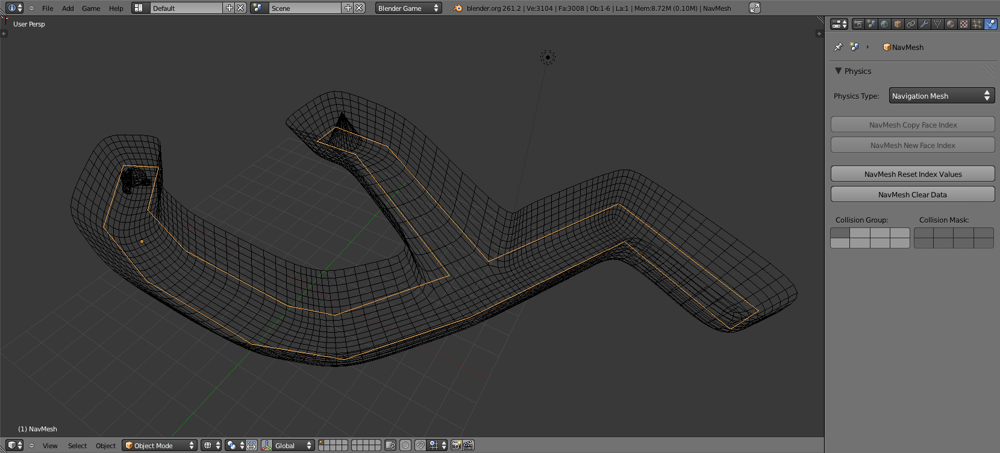

4.A navigation mesh is a helper object (invisible while the game is running) that is used to help guide other objects along a path. The NavMesh object is a regular mesh object that defines the shape of the accessible area for the pathfinding routine.

5.There are two ways to create a navigation mesh. One is to manually model a geometry that covers all the areas that are accessible to a character. This is what we have done with NavMesh.

6.Another option is to ask Blender to create a navigation automatically. It might be easier for larger maps, but the result is far less predictable. We will cover this functionality at the end of this hands-on tutorial.

7.Make sure that the NavMesh object is selected and change its physics type to Navigation Mesh. The NavMesh will turn into a colorful grid, but don't be alarmed[md]this is normal. It means the object now can be used to aid in navigation. Navigation meshes becomes invisible when the game is running.

8.Select the Monkey object and add a "steering" Logic Brick actuator to it, as shown in Figure 6.18. Define the target and navigation mesh object, as shown in Figure 6.19.

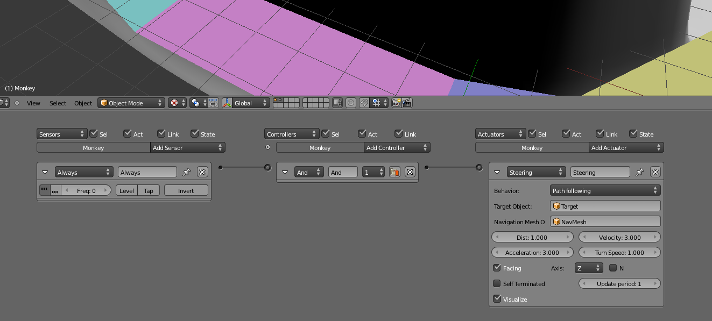

9.And you are done! Start the game and watch the monkey seek out the cone. The Steering actuator contains additional options that you can explore.

10.Figure 6.19 shows the finished game running in the Blender game engine. You can check out navigation-finished.blend.

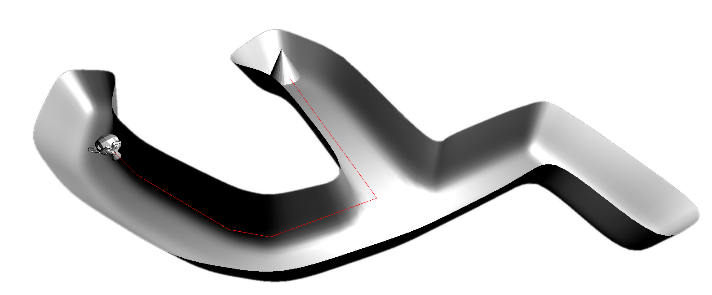

11.As promised, another way to create a navigation mesh is to use the automatic generator. To do this, delete the NavMeshobject first so you can start with a clean slate.

12.Select the object you want to use as the guide in creating the navigation mesh. In this case, you need to select VisualMesh. Blender will build a new navigation mesh based on this mesh.

13.Go to the Scene tab of the Properties Editor, as seen in Figure 6.20. You should see a "Build Navigation Mesh" button, along with a whole slew of settings.

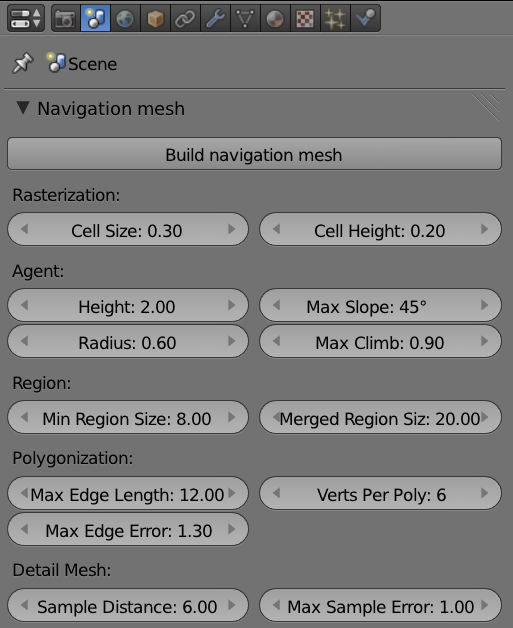

14.Pressing the aforementioned button will create a navigation mesh automatically from the visual mesh.

15.If the result isn't optimal, play with the settings. Agent Radius is a good place to start.

\*\*\*End Tutorial

### Characters

This is a specialized physics type that is designed specifically for player-controlled characters. This physics type follows the basic rules of kinematics, while ignoring some of the other physical rules in order to make the object's behavior more predicable. For example, the character object type doesn't bounce off walls or slide on ramps. PhysicsType.blend has an example of a playable character object that walks around. Try to move it with the arrow keys.

## Common Settings

Whew. With all the physics types out of the way, let's look at some of the shared settings common to most of the physics types described earlier.

**       ** [lb] **        Actor:** Makes the object part of the physics evaluation loop. An object not marked as an actor is ignored by the Near and Radar sensors, although it will still obey the laws of physics.

[lb] **Ghost:** Makes an object not react to collisions such that it will pass through another[md]like a ghost. Collisions are still detected for ghost objects, so any sensors that detect collision between two ghost objects will still fire, but the objects will not bounce apart as they normally would.

[lb] **Invisible:** Skips rendering of the object while still calculating all the physics and logic. This is useful for creating invisible walls and edges of maps to prevent players from visiting places you do not want them to go.

[lb] **Mass:** Sets the mass of the object. A heavier object requires more force to move. Contrary to intuition, a heavier object does not fall faster than a lighter object (see note, "Hammer and Feather"). So increasing the mass will not make your object fall faster. To make objects fall faster, lower the damping on the object or increase the gravity in World settings.

\*\*\* Begin Note

Hammer and Feather

A hammer and a feather fall at the same rate in vacuum! In air, the drag force will slow down a lighter object more than a heavier object, so a heavier object indeed falls faster than a lighter object. But since Blender does not model air friction, object mass does not affect how fast they fall. This is not a bug!

\*\*\* End Note

Just as an 18-wheeler truck hitting a bunny won't have a happy ending (for the bunny), the physics engine works best when the objects interacting have masses of a similar magnitude. When an object with a very large mass collides with an object with a very small mass, instability might be created in the physics engine. As a general rule, keep all objects within 2 magnitudes of mass to each other. So, if an object weighs 1.0, it shouldn't interact with an object that is much heavier than 100.0.

[lb] **Radius:** Controls the radius of the collision sphere. If a collision bound other than Sphere is selected, this setting has no effect.

[lb] **No sleeping:** By default, the physics engine automatically suspends the physics calculation for an object when its motion is sufficiently slow. This is known as "sleeping." Putting the object to sleep can free up the CPU cycle and increase game performance until another object interacts with it again. Putting objects to sleep can cause some odd-looking behaviors, such as slow-moving objects coming to a sudden stop. "No sleeping" disables this optimization. The downside is that "no sleeping" might lead to some odd, jittery behavior for objects that are not perfectly stable.

Additionally, there are options for controlling when objects go to sleep in the World properties under the "Physics Deactivation" label. This settings can be used to change the global delay before objects are deactivated.

[lb] **Damping:** Applies a drag force on an object. A damping of 0 corresponds to no friction at all, just like a spherical cow traveling in a vacuum. A damping of 1.0 corresponds to a drag force so strong that the object will be unable to move. Translational damping slows down an object's movement; rotational damping slows down an object's spinning.

[lb] **Anisotropic Friction:** Controls the friction force per axis. You can use this to mimic objects that have different coefficients of friction, depending on the orientation of the object. For example, a skateboard slides easily along its length, but is almost unmovable sideways.

[lb] **Form Factor:** The tooltip says this setting "scales the inertia tensor." Make sense? No? Well, aren't you glad you have this book! Form factor controls the tendency for an object to roll. The bigger the value, the less likely an object will roll and tumble. A smaller value makes the object much more likely to rotate. Set the value too low, and the object will become unstable. The default value is a good balance between physics stability and realism.

[lb] **Collision Bounds:** This is the shape of the object as it appears to the physics engine. This might sound surprising, but the shape of the object used for physics calculation is not always the same as the one that is displayed. The distinction is important because, for performance reasons, a rough proxy shape is often used in place of the actual geometry. This way, the user still sees a fully detailed object on the screen, but the physics engine can run a lot faster using a simplified collision bound. It is important to try to use the simplest collision bounds possible in order to keep the game engine's performance fast.

**       ** [lb] **        Capsule** , **Box** , **Sphere** , **Cylinder,** and **Cone:** These are some of the basic primitives that can be used to approximate different collision bounds (see Figure 6.21). Their shapes are self-explanatory. To see exactly how the bounding box is applied to your model in-game, turn on "Show Physics Visualization" in the Game Options screen.

When the collision bound is set to Convex Hull, the collision bound takes the shape of the object, but with all the concave areas filled in. Convex Hull can accurately approximate an object of any shape as long as it doesn't have any "negative" space, such as holes. For example, a doughnut-shaped rigid body object set to Convex Hull will be treated as if the hole isn't there.

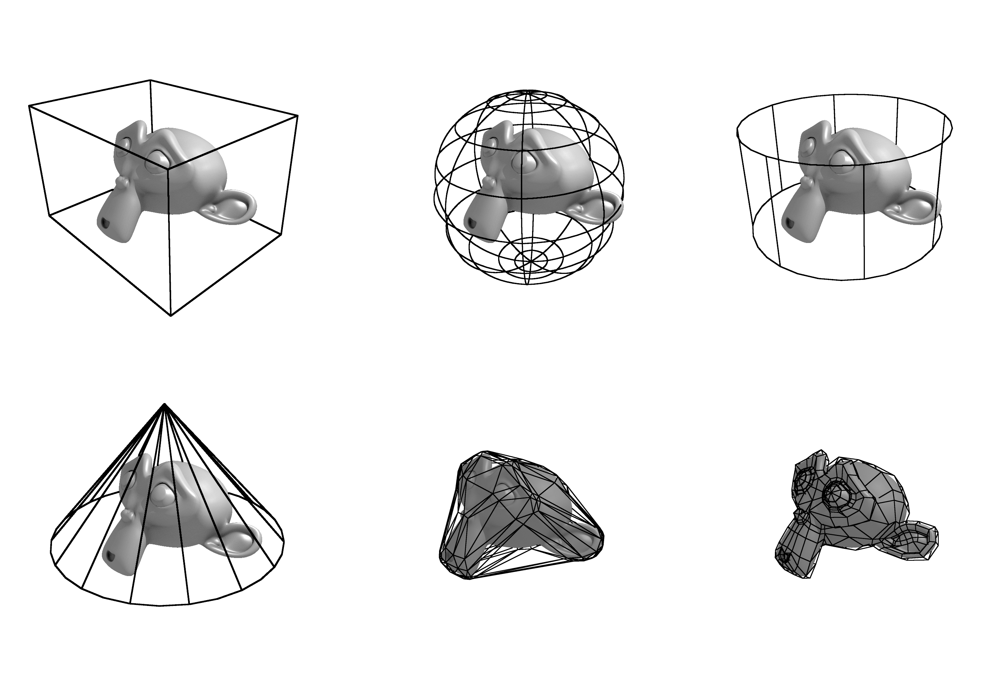

**        [lb]        Triangle Mesh:** This is the most robust collision bound type. It will create a collision bound that is an exact duplicate of the actual mesh. If you want to ensure that the collision bound matches the visual mesh exactly, this is the setting to use. So why don't we use this setting all the time? The reason is performance and stability. The physics engine is far better optimized for simple primitives, such as a box, than an arbitrarily shaped triangle mesh.

\*\*\* Begin Note

Visualizing Collision Bounds

Once the collision bound is set, you should notice that the collision bound is visualized as a dashed lines in the 3D viewport. This helps you visualize the relationship between the collision bounds and the visual mesh.

To visualize the collision bounds in-game, turn on "Show Physics Visualization" in the Game Options screen and run the game.

\*\*\* End Note

[lb] **Collision Margin:** The Bullet Physics Engine SDK Manual explains that the collision margin is an internal setting that improves the performance and stability of the collision detection by giving thickness to each face. It is highly recommended that you do not adjust this setting outside its normal range (0.05). In some cases, too high of a value will result in a tiny air gap between colliding objects. Too small of a value will increase the chance of missed collisions between objects.

**       ** [lb] **Compound:** The compound setting makes objects linked together by parent-children relationships behave as if they are a single physics entity.

But, why use compound when you can just join your objects together with Ctrl+J? Apart from the fact that there might be times when you need to control individual objects (so joining them might not be an option), using compound collision bounds made up of simple primitives is actually recommended over using one triangle mesh collision bound. The reason is again that a combination of simple primitives is faster to compute than a triangle meshes.

\*\*\*Begin tutorial

### Hands-on Tutorial: Creating Compound Objects

To create a compound physics object (see Figure 6.22):

1.Open /Book/Chapter6/compound.blend.

2.Run the game. Notice that even though the three objects are parented together, they do not react to the ground plane in a convincing way. Only the parent object collides with the ground.

3.To change that, from the Physics Properties Editor, turn on Compound for each of the three objects.

4.Run the game now and notice that all objects contribute to the kinematics of the group.

\*\*\*End Tutorial

## Material Panel Physics Settings

By adding a material to the object, you enable additional options that give you finer control over some of the physical properties of the surface. Figure 6.23 shows the physics settings found in the Material panel.

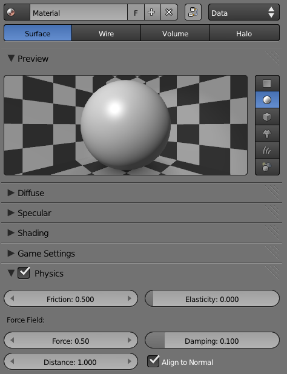

[lb] **Friction:** Controls the force that slows down a moving object when it comes in contact with another object. The effective friction force between two objects is dependent on the friction settings on both objects. So if one object with a high friction setting comes in contact with another object with low friction, the effective friction force would be somewhere in the middle of the two values.

[lb] **Elasticity:** Controls the "bounciness" of the objects when they collide with another. An object with low elasticity does not bounce away as far after a collision; an object with high elasticity loses almost no momentum in a collision and bounces away at almost the same speed as it came in. The effective elasticity between two colliding objects takes both objects into account. A tennis ball hitting a hardwood floor would be an example of an elastic object colliding with another elastic object. A tennis ball hitting carpet would be an example of an elastic object colliding with a non-elastic object.

[lb] **Force Field:** The next set of settings controls what Blender calls _force field._ When the force and distance are set to non-zero, a force field is generated on all the faces so that any object that comes within range (as specified by the distance setting) is pushed away with a certain force (as specified by the force setting). The result of this is that object that comes close to a force field surface will be repelled. The effect on the object is exactly as the name implies: it mimics a magnetic field. The damping setting slows down the object.

Once Force Field is enabled in the Material panel, you will need to tell individual objects to respect that setting by going into the Physics Properties Editor and turning on Use Material Force Field.

\*\*\*Begin Tutorial\*\*\*

### Hands-on Tutorial: Force Field Water Surface

Force field can be used to create a convincing[md]you guessed it![md]force field effect, where an object moving toward a force field seems to be slowed down by invisible energy. This is very different from the usual rigid body interactions, which are always hard collisions.

As you might imagine, the Force Field setting is used to simulate the realistic interaction of floating objects on a calm water surface. To do this:

1.Open /Book/Chapter6/water.blend.

2.Select the _Cube_. You want this object to behave like a basic wooden crate, a crate that bounces, tumbles, and floats in water. So let's add some dynamics to it. Go to the Physics Properties Editor and set the Type from Static to Rigid Body.

3.For extra fun, let's make a lot of these crates! But instead of manually creating them, we'll dynamically add them in-game on the player's command.

4.Select the Camera object in the Logic Editor panel and add a new Keyboard sensor, a new And controller, and an Edit Object actuator, as shown in Figure 6.24.

5.To make sure that the cube objects get instantiated when you run the game, you need to hide the original cube object. To do this, simply move the Cube to the second layer by pressing M and then 2.

6.With only layer one selected, run the game now. Notice how the cubes all collide with the ground plane, but because the ground plane is hard, the motion is rather jarring. It doesn't look like objects floating on water at all.

7.To make the ground plane have a water-like property, we will turn on Force Field. First, select the object called _WaterPlane._

8.Head to the Material Properties Editor and create a new material. Then simply copy the force field physics setting, as shown in Figure 6.25.

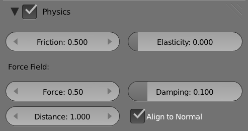

9.Et voilà! Start the game, press the spacebar, and watch the crates tumble into the ocean.

10.For added realism, create a No-Collision Plane on top of the WaterPlane to act as the water surface.

\*\*\*End Tutorial

## Constraints

Constraints are frequently used to create joints and mechanical linkages, indispensible components of many games. The Constraints Properties Editor is shown in Figure 6.26.

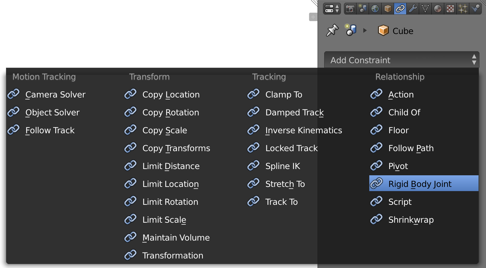

The only supported object constraint is the Rigid Body Joint. It is used to connect two objects together using a user-defined joint.

Figure 6.27 illustrates the variety of pivot types.

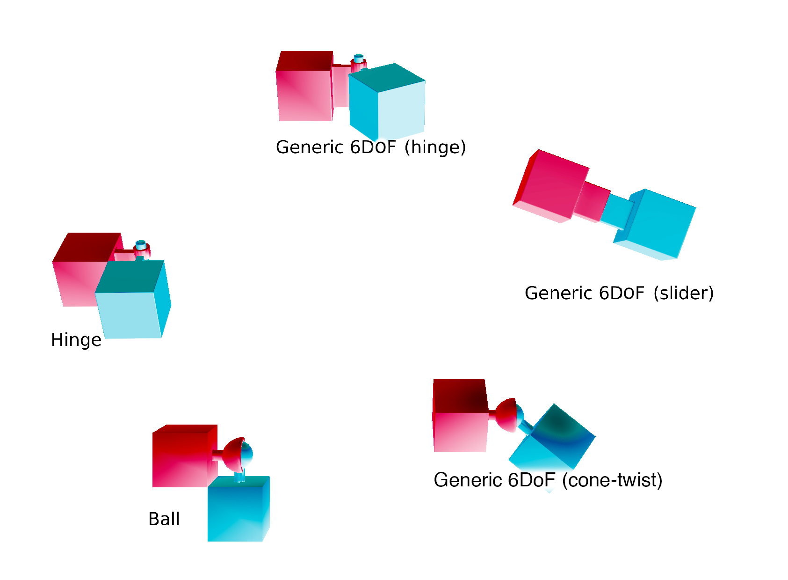

[c] 2014 Cengage Learning[r]. All Rights Reserved.

**       ** [lb] **        Ball:** Joins two objects together using a ball-and-socket joint. This type of constraint is free to rotate around all three axes.

**       ** [lb] **        Hinge:** Joins two objects together using one axis[md]the hinge axis. This constraint is often used to simulate a door hinge or a wheel on an axle.

**       ** [lb] **        Cone-twist:** This is an extension of the Ball constraint that supports limiting the angle of rotation. This is especially useful for animating limbs using ragdoll physics. You can set the individual angle limits for each of the three axes.

**       ** [lb] **        Generic 6 DoF:** If none of the above constraints meet your needs, chances are this generic constraint will give you enough control to accomplish any mechanical linkage you can dream up.

Once you have decided on the pivot type you need, you'll need to set the Targetobject. The Target object is the object that the current object will be linking to.

The rest of the settings should be very self-explanatory. Refer to /Book/Chapter6/demo/constraints.blend to see each constraint's type in action.

[lb] **Extending Constraints:** While one constraint might not be too useful, constraints can be daisy-chained to simulate many different objects. See ConstraintsChain.blend, ConstraintsWaterMill.blend and ConstraintsTrampoline.blend for examples of how to set up multiple constraints.

## Vehicle Physics

The Blender physics engine has built-in support for vehicle physics. It is a very stable physics constraints system that provides easy-to-set-up car physics. The result is a fast-performing vehicle physics engine with easily tweakable settings that maps well into a real vehicle (steering, suspension length, suspension stiffness)

Of course, you can also try to create a car physics setup without using the built-in physics constraints; however, it will be far more time-consuming. This section will demonstrate how to set up a playable car object in the game engine using the built-in Bullet engine and a bit of Python scripting.

\*\*\*Begin Tutorial

### Hands-on Tutorial: Vehicle Physics Using Python

To get started, open /Book/Chapter6/vehicle/car.blend.

Rather than presenting this as a step-by-step tutorial, we will dissect a fully working, pre-made file.

Our basic car is composed of a body object and four wheel objects. The wheels are separate from the car for now. The physics engine will be responsible for keeping the wheels attached to the body, so the location of the wheel objects does not matter at this point. In this file, they are placed close to the car body for convenience.

Because attaching the wheels to the body will be done by a script, it is crucial for the rotation of the wheel to be correctly set; otherwise, the wheel will be linked to the car in the wrong orientation once the physics engine takes over. In the sample file, notice that the wheel objects all have their rotation set to [0,0,0]. This is important because the local rotation on the objects will interfere with the physics engine and confuse the game engine, resulting in unexpected behavior when you try to attach the wheels to the car. If a wheel needs to have its rotation reset, press Ctrl+A to apply any rotation.

Also notice that the car body is a rigid body object with ghost turned on. This setting is crucial for the car physics to run correctly.

That's pretty much it[md]a car body object and four tires make up the vehicle.

As already mentioned, the actual vehicle physics relies on some Python script to function. Figure 6.28 shows all the logic bricks that are attached to the car body object. Notice that script plays a big part in it.

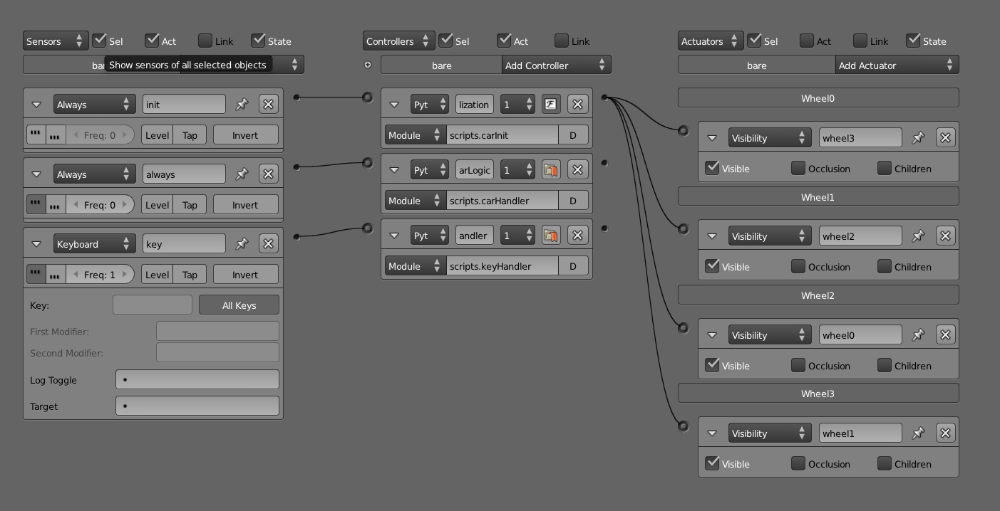

The script.carInit() functionality is run when the game is started. Here, it initializes the car as a "vehicle constraint," also known as constraint type11, and stores it as a Python object called _vehicle_. The same script then looks for the four wheels by accessing an actuator with specific names (in this case, wheel1, wheel2, etc.), and then the script attaches the wheels to the car body using the settings specified in the script. Variables such as RollInfluence, SuspensionStiffness, and TyreFriction can all be set on a per-tire basis once the vehicle object is created. The job of carInit() is now done. Your car body is now considered to be a vehicle by the game engine, and it will behave like one.

The second most important function, script.carHandler(), is run every frame. This script does the actual moving of the car, and it applies engine force and steering to the vehicle object. But this script gets the user input (keyboard sensor inputs) from another source (see below). The vehicle wrapper has built-in methods such as applyBreaking(), applyEngineForce(), getWheelRotation(), and getNumWheels, which you can call.

Every time a key is pressed, script.keyHandler() is run. It figures out which key is pressed and sets the intermediate variable so that the scripts.carHandler function will know how much throttle to apply, which way to steer, and so on. This script is separated from scripts.carHandler() not because of technical limitations but by design, so that it's easier to manage the code.

With these three Python functions, the car comes alive.

\*\*\*End Tutorial

## Game Settings

Game settings are global settings that affect the running of the game. These settings are shown in Figure 6.29 and can be found in the Render panel.

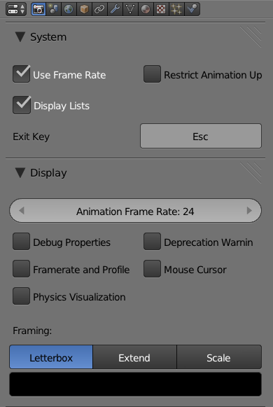

[lb] **Animation Playback Speed:** Closely related to the frame-rate setting is the animation playback speed. This setting controls the speed of the F-Curve and armature animation. By default, the value is set to 24, meaning all F-Curve and actions will be played back as if they are running at a 24fps timebase. This setting can be found in the Render panel.

[lb] **Debug Property:** Shows the value of the Game Properties that are marked with the Debug flag. This can be useful when you want to keep an eye on the values of certain variables while the game is running.

[lb] **Frame Rate and Profile:** Shows the frame rate and other performance statistics in-game. These statistics will be displayed in the top-left corner of the screen in-game.

[lb] **Physics Visualization:** Visualizes the internal computation of the physics engine. This can help you see what the physics engine is really doing when the game is running.

Rigid Body objects are displayed in white, and sleeping objects are drawn in green.

[lb] **Deprecation Warning:** Gives warnings about outdated Python API called in the console (see Chapter 7).

[lb] **Mouse Cursor:** Draws the mouse cursor in-game. This is useful if the game uses mouse-input. Mouse cursor can also be turned on and off via Python.

## Stabilizing Physics

The Bullet physics engine is good. Really good. But as with anything that is powered by a computer, it is still possible to get into a situation where things go haywire.

Okay, so what is unstable physics anyway? When you see objects jitter around when they are not supposed to, or when objects go through each other when they are supposed to collide, you know it's time for a reality check.

Here are some tips to help you regain control of your game. All of the settings here are already covered in the chapter; this list is simply a collection of the most common actions to take to stabilize physics.

[lb] **Avoid Extremes:** Avoid interaction between an extremely heavy object and an exceptionally light object. Avoid interaction between extremely fast objects. Avoid interaction between objects of very different sizes, especially if neither object is static.

[lb] **Physics Substeps**** (World Properties Editor):** Crank it. Higher will be slower but gives much a more accurate physics simulation result.

**       ** [lb]**        Bounding Box (Physics Properties Editor):** Try to use collision primitives (sphere, cube, cylinder) rather than mesh-based collision boxes (triangle mesh or convex hull). The former will be more stable and perform faster.

**       ** [lb]**Form Factor (Physics Properties Editor):** Controls the rotational tendency of an object. Setting this too small will make moving objects extremely unstable. Increasing the form factor usually helps calm down the object, at the cost of making the object feel sluggish on collision.

**       ** [lb]**        No Sleeping (Physics Properties Editor):** By default, this option is off, meaning objects "freeze" when their movement falls below a certain threshold for a certain time. Keeping the option off improves physics stability and performance.

**       ** [lb]**        Object Damping (Physics Properties Editor):** For non-static objects, Translational Damping and Rotational Damping can be used to slow objects down. Setting this to a non-zero value ensures that objects eventually will slow down to a stop, which might help with stability.

**       ** [lb]**        Margin (Physics Properties Editor):** If objects go through each other when they are not supposed to, and you've exhausted the other options listed above, increasing the object collision margin might help.
