# Chapter 10: Case Studies

By now you should have a very good command of the Blender game engine. Armed with this newfound skill, no doubt you are bursting with ideas. Whether you are working alone or with a team, completing a game from start to finish is a lot of work. It is also a lot different from the examples and tutorials we used in the book, which are often stripped down to the most basic in order to be didactic. Real-world productions usually involve many more files, which are larger, more complex, and messier. This chapter tries to ease the transition between the classroom and the real world by showcasing other people's finished work.

The Blender-made games selected for this chapter represent some of the best work in quality, gameplay, and visuals. Some are also selected for their interesting use of the game engine in non-traditional ways. By seeing what is possible with Blender, we hope you will be inspired to learn from these masters of the Blender game engine. By showcasing some of the different uses for the game engine, we hope you will realize that the game engine is not just a video-game production machine, but also a sandbox that allows you to do almost anything.

All the games mentioned here can be found on the book website for you to play, and when the authors are willing, the blend source files are also provided so that you can freely explore the file on your own. You will notice that each artist has a unique style in file organization, scene structure, techniques, and tricks. Most of these tricks might be invisible to the player when the game is running. But by looking at the source file, you can gain much insight into how the game is made.

\*\*\* Begin Note

Blender Versions Clash

We worked hard with the authors of these games to make sure that all the included games on the disk are playable in the latest version of Blender; however, due to limited time, some games might require a different version of Blender to run. Refer to the readme.txt file within each game folder for system requirement.

\*\*\* End Note

## Super Blender Galaxy

Carlos Limon

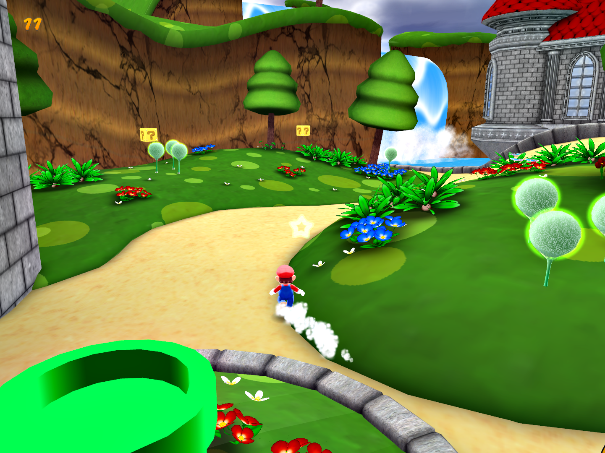
_[c] 2014 Carlos Limon._

_[c] 2014 Carlos Limon._

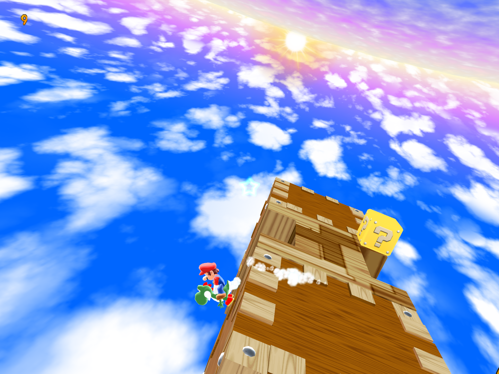
_[c] 2014 Carlos Limon._

Super Blender Galaxy wooed the Blender community with its fantastic artwork and slick gameplay. Carlos Limon is a relatively new member to Blender, but he wasted no time in single-handedly creating a stunning game that took home a very well deserved first place in the 2010 Blender Game competition.

Based on Super Mario Galaxy, Super Blender Galaxy was inspired by the art and gameplay concept from the classic Nintendo title. Of course, Carlos had to remake all the artwork from scratch. It took eight months of hard work to get the game ready, an impressive feat considering it was a one-man production.

What strikes us about this game is its attention to detail: every component of the game just feels polished right from the introductory screen. Objects look like they fully belong in this fictional universe, the effects are superb, and the gameplay is just what you'd expect from a Mario game.

Carlos explains how the game was made:

"It wasn't till around 2009 that I found Blender. I have never had experience with any kind of 3D software. I actually stumbled onto Blender when I was trying to learn how to make those stereogram images that look like a mess of stuff that you have to cross your eyes to see.

I picked Blender up pretty quickly. I've always had artistic talent so modeling, texturing, and animating was easy. Learning the Blender interface was the hard part. Once I got over this hump, I decided to tackle the game engine. I made some small demos here and there, but nothing as polished as Super Blender Galaxy[SBG]. The one thing that set SBG apart from all my other games was that I taught myself Python over the duration of the production. I still consider myself a Python newbie, but I pulled off what I needed for the game. There were close to 100 different Python scripts in SBG, and getting them to all work seamlessly was no easy feat.

I started on SBG in March of 2010, and it took me eight months to get this demo out. There really was no planning when I started out. I kind of just kept moving forward. Once I modeled, textured, and animated Mario, I focused on all of his functions and smart cameras. I had to watch a lot of Mario stuff to see how the controls and camera systems worked; then I actually duplicated everything I saw. This was extremely difficult for me, considering that I'm just one person, and I'm trying to match what the professionals are doing.

Once I got this done, I kind of hit a brick wall. I had no ideas for level design. I did get a lot of help from my girlfriend (Alexis F. Porter) in this department. She had some off-the-wall ideas, such as antlers on Yoshi, a sleigh ride race, and of course Skunk Mario. I ended up just replicating Puzzle Planck Galaxy to rush things through.

The Blender community helped me throughout the process, although no one knew what they were helping me with as far as the project goes. When I ran into problems with code, I would post a snippet of my problem, and overnight people would respond with an answer or point me in the right direction. I am very appreciative of that."

Carlos aspires to become a game developer and is currently studying Game Development and Computer Programming in San Antonio, Texas. A playable version of the game is available on the accompanying disk.

## Lucy and the Time Machine

Vitor Balbio, Bernardo Hasselman

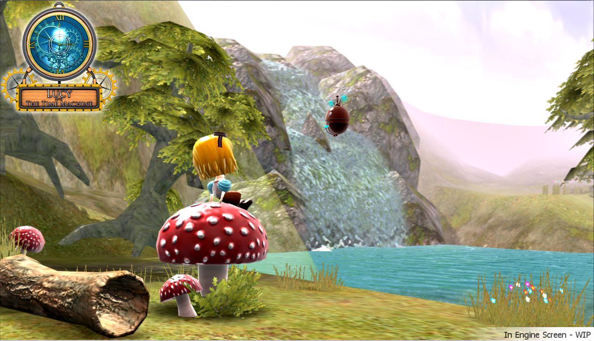

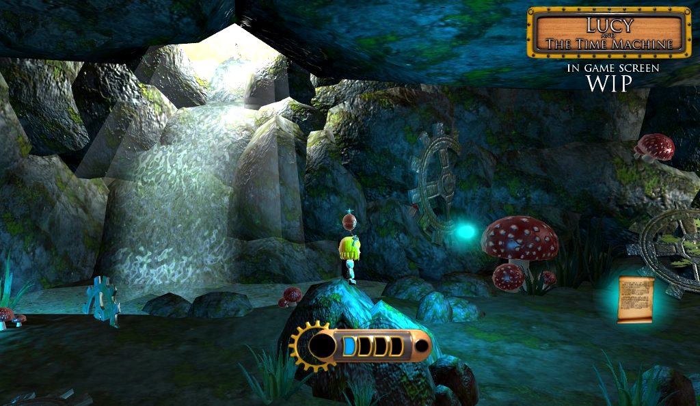

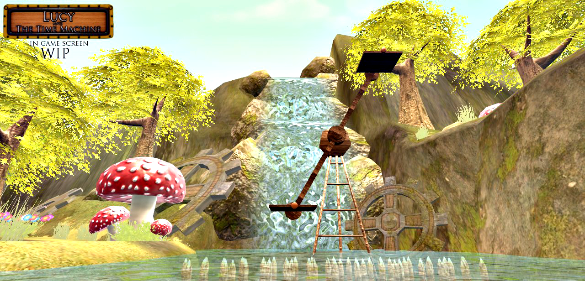

Every year the Blender community hosts game engine contests that invite people to create and share their Blender skills. As a response to the contest, in 2010, Vitor Balbio teamed up with Bernardo Hasselman, who contributed to the concepts, story, and level design. Together, they created a perfectly executed platform-puzzle game that forever raises the bar for Blender-made games. The result is a game with a rich story that involves Jules Verne, a Time Machine, and a robot sidekick, all taking place in a beautifully rendered 3D environment.

The game is notable for being one of the most professional-looking Blender games out there. It was produced by just two people over the course of four months. The game makes heavy use of the Bullet Physics engine and relies entirely on logic bricks. No Python is used at all. We can't think of a better way to show off the power of the game engine.

Victor Balbio explains in detail the making of the game:

"Bernardo and I were very rigid in adhering to our work plan. We followed a strict design workbook known as our 'Game Bible' that contained all workflow, game planning, concepts, and notes. This allowed us to see what was doomed to fail early in the project[md]way before ideas materialized into pixels. The Blender community was also quite receptive to the project. Those factors were fundamental for us to complete our creation.

The game aims to be an enjoyable experience for the player, in part accomplished by visuals[md]matching the quality standards of an indie game[md]and its strong plot. The gameplay was based on platform games with puzzles closely connected to the cinematic and time control of the game. The games _Trine_ and _Braid_ were a big inspiration for our work.

_Lucy and the Time Machine_ was created entirely with logic bricks. While this made our lives easier on many occasions, this also constrained us a lot. Without using Python, one of the biggest limitations was not being able to animate the values of the Motion actuators. The high number of logic bricks quickly became hard to manage. Thus, we had to rely on strict documentation for naming conventions and other internal rules.

A few months after the demo release, we started working on a second version of the game (not yet released). This time we were using Python scripting for some of the tasks. Thanks to that, we already had the following: save and load, checkpoint, and better animations.

For this project, the most limiting aspect of the Blender game engine was the lighting. Our inability to dynamically add lights and their slow performance affected some of our design decisions. Sound also proved to be an issue in 2.49 when it came to cross-platform support. Luckily, it's working smoothly in Blender 2.5.

Despite its limitations, I see Blender as an excellent tool for diverse goals. In the field of prototyping, commercial and scientific visualization, virtual walkthrough … I don't know a tool with a better trade-off between robustness and ease of use. The integration with Blender and the logic brick system allowed us to produce fantastic results in a short window of time. I'm also unaware of another open game engine with a better and easier material system (which is my favorite reason for working with Blender).

Our future plans are to port _Lucy_ for other publishing platforms, such as WebPlayer and iOS. Our goal is to stick to Blender for prototyping though.

Keep Blending!"

Vitor Balbio's previous work includes a stunning looking demo scene called "Ruínas" (Ruins), which competed in the graphics category in an early edition of the same competition. Information about _Lucy and The Time Machine_ can be found on Vitor's blog (in Portuguese): [_http://obalbio3d.wordpress.com/_](http://obalbio3d.wordpress.com/)

## The FPS Project

Chase Moskal, Geoff Gollmer, Martins Upitis, Mitchell Stokes, Daniel Stokes, Lonnie Ralfs, Fleeky Flanco, Thomas Lobig

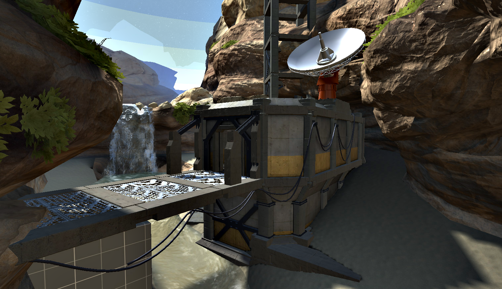

The _First-Person-Shooter Project_ was an attempt to create a solid online multiplayer shooter in the game engine. It began a few years ago with Chase and his good friends, Geoff and Lonnie. All three had played around with the game engine for years, and had always wanted to make an FPS, a goal that certainly aligned with the interests of many gamers and game developers alike. The project took off with enthusiasm and energy. Unfortunately, high self-expectations led to a loss of focus as the project progressed[md]the project lost steam as the game's complexity spiraled out of control. This all-too-familiar story is unfortunately common to many amateur game developers. The _FPS Project_ is currently undergoing a refactoring, and Chase hopes that this time, by keeping the project goals clear and reasonable, the project will not reach the same fate as last time.

Chase wants to share their story so that you won't repeat the same mistakes as they did:

"Just a month or so into the start of the project, Martins Upitis spontaneously contacted  Geoff, Lonnie, and me. He had checked out our previous project, _Nanoshooter_ (a top-down multiplayer shooter, which was more or less a precursor networking test for the _FPS Project_), he was very impressed, and explained how he'd like to make an FPS with us. We were ecstatic, as Martins was our favorite artist of the Blender community.

We were soon joined by more talented people, including Daniel and Mitchell Stokes, Fleeky Flanco, and Thomas Lobig. With the help of Mitchell and Geoff, I began developing the code base. Online multiplayer is a lot more than just transferring data over sockets: the entire game engine needs to be structured in a way that is conducive to multiplayer. Concepts like GameState and entity management are not built into the game engine, so we improvised them with Python scripting. It really felt like building a game engine within a game engine.

An early challenge was figuring out how to best organize the project's source. We eventually settled on a system that uses Blender's ability to dynamically link objects in from one blend file to another. Environments (levels) are kept in individual blends. All of the game's programming was external from the game engine, and it all ran from one master script called "mainloop.py." Each level linked in the game's programming (which is in its own blend file) that ran the mainloop script every frame. This system kept the programming separate from the levels, and let us organize the game's programming in any way that we wanted. To play the game, the main menu just started up the chosen level's blend file, passing information such as the server's address.

We used Google Docs to collaborate on our plans, to-do lists, and just about anything else. It's an invaluable tool for collaboration, as is Subversion and Google Code. Tools like these are absolutely essential to manage a project of almost any magnitude.

Despite getting a lot of cool work done and learning a ton in the process, it didn't quite work out. Unfortunately, being an inexperienced project manager, I failed to keep us focused on achieving realistic goals. Our team's goals for the project grew out of control: not only did we want a multiplayer shooter, but soon we had plans for a co-op survival mode with hordes of bots; character classes and weapon customization; vehicles and even drop-ship insertions. Before long, the network code became too complex to work on, and our team's motivation declined to nothing.

I'm sure this story sounds familiar to hobbyists of any kind. Most Blender users I've talked to bear the psychological scars of an abandoned beloved project. It's important to set realistic goals. You need enough ambition to inspire initiative, but you must be careful because motivation can easily drown in over-ambition.

It's not all doom and gloom, though. After a long stretch of inactivity, Geoff and I have rebooted the project, but this time vowing to keep things simple. We've stripped away unnecessary ambition, and we're hoping to finish the project as a multiplayer template to be released as open source to the Blender community."

As the project is undergoing a restructuring, no file is available to the public yet. You can learn more about the FPS project at _https://code.google.com/p/fps-project/._

## Whip Frog

David Thompson, Campbell Barton, Daniela Hammer, Alex Fraser, Luca Pavone

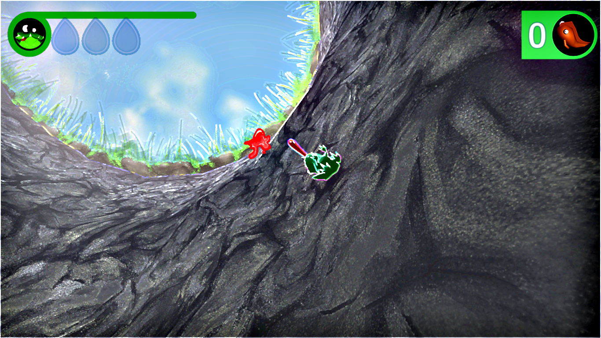

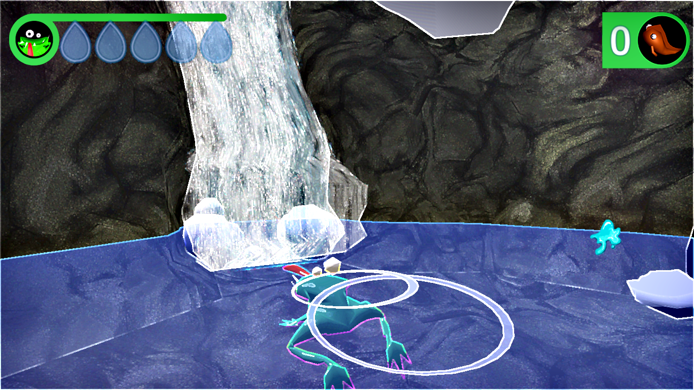

How fast can you build a game? A month? A week? What would you do if you only had 48 hours to make a game with a group of five people? This is the premise of Global Game Jam, an annual event that invites developers and artists to come together to create games from scratch within 48 hours. Alex Fraser participated in the 2011 Game Jam with Blender developer Campbell Barton and three other artists. During those two days, they each slept only a few hours per night, each accomplishing the equivalent of a full week's worth of work by the end of the Jam.

This game shows one area of Blender that is great for game development: rapid prototyping. Thanks to logic bricks, a fully functional Python API, and the integrated workflow, a team can build a game in no time. However, Blender isn't without its downside. The team expressed concern over the lack of version control or collaborative tools within Blender. Without this, only one person can work on the file at a time, which can be frustrating when working under such a tight deadline.

Despite the pressure, the result is a game that is visually unique and fun to play.

Here is Alex Fraser and Daniela Hammer's retrospective on the intense 48 hours:

"The original idea for the gameplay came from Campbell Barton. He had the idea on the way to the competition, and then we just had to extend it to make it fit with the theme of this year's event: Extinction.

We spent the entire allowed time[md]48 hours[md]to build the game. The team consisted of 1.5 artists, 1 programmer, 1 integrator, 1 musician and 0.5 designers. Only half of the allocated time was actually used to develop the separate pieces for the end product of the game. Almost as much time was used for test-playing and discussion between group members. This involved keeping constant track of what each team member was creating and making sure that individual team members were up to speed with the rest of the team. While this method demanded a significant portion of time, it ensured that we worked efficiently and allowed us to catch many potential problems in their infancy.

An example of this would be during some of the early game mechanics testing, where we soon found out a horizontal approach for movement was more difficult and less enjoyable than a vertical approach. Were we to only play-test at the end of the game, we would have ended up with a very different and potentially much less enjoyable product.

For us, asset management was hard. We were passing files around on USB sticks. The big problem was that only one person could work on a Blender file at a time. If only we could merge blend files like you can with programs. Or perhaps Verse (a collaborative networking solution that allows multiple people to collaborate on one file at the same time) would help. So we had Campbell doing pretty much full-time integration of the assets that the artists were making with the main game.

We loved the tight integration of the game engine with Blender. It's such a great way to develop something, given the time constraints we had.

Everyone agrees that the biggest challenge during the Game Jam is  forcing yourself to walk away from development to go to sleep.

You can learn more about this game at _http://globalgamejam.org/2011/whip-frog._

## Tectonic

Andrew Bentley

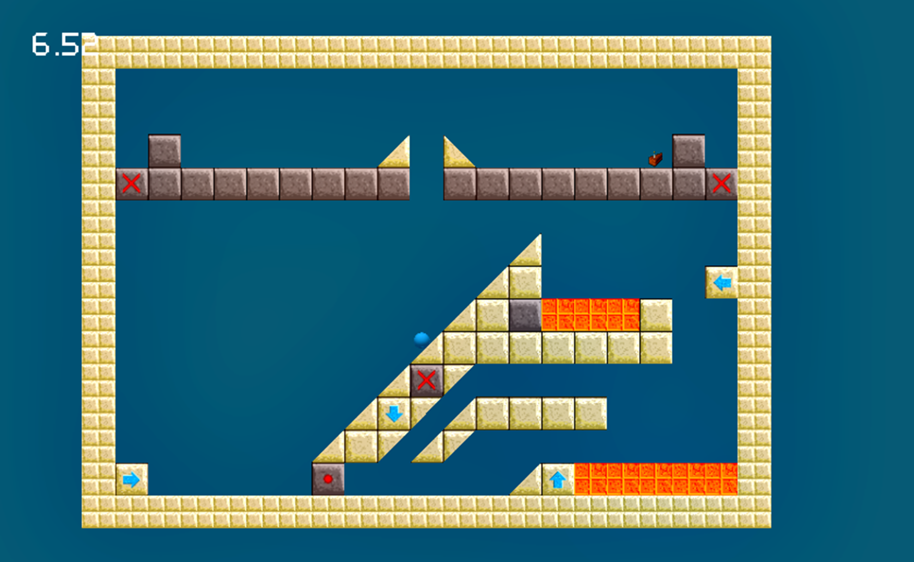

Being a 2D game that looks like something ported from the Nintendo 64 era, _Tectonic_ might not look like a groundbreaking game at first glance. But after trying it out, you will be thoroughly impressed with the innovative gameplay mechanics and progressively harder levels that have many of the hallmarks of a professionally made game. If you take it one step further and dive into the source code of the game, you will be impressed as well by the design and programming behind the game's puzzle engine.

For Pythonistas interested in extending their programming skills, this game is a treasure box. Andrew uses Python extensively for the game. The game also made use of Mitchell Stokes' BGUI module, which is a Python module for Blender that helps in the creation of user-interface in the game engine.

Despite the extremely late start, Andrew made an impressive puzzle game that won third place in the 2010 Blender Game Competition.

Andrew explains how he made the game in three days:

"I first got the idea for _Tectonic_ three days before the competition deadline. I was attempting to solve the Rubik's Cube when I thought "hey, this could make a pretty cool mechanic in a game" and "oh hey, there's a game competition on right now." So I guess the game competition and stiff schedule really made me work hard on it. I wanted to get something playable out before the deadline, sort of like a prototype. So I jumped on Blender and dived straight into it. I didn't do any planning or anything; I just wanted to get some sort of Rubik's Cube-esque 2D game mechanic working inside Blender, which didn't take long at all. What I had was a grid of tiles that could be slid around, and that was it.

So I decided I probably needed to figure out what I wanted to do before moving on. I was intending for it to be a top-down perspective at first, so you could see a lot of variables called "y" defining a lot of z ordinates in the code. I still didn't really do any solid planning. I just decided on what the gameplay was going to be. Thinking back, I probably should have thought out the game in a little more detail. I'm still actively developing the game, and still haven't done any planning. I find that once I finished adding a feature or fixing a bug, I just sat there playing in the menu and thinking "what now?" It's a lot of wasted time, but the way I structured the game was quite future-proof, so if I suddenly get an idea I can just add it in. I don't have to spend hours fiddling in the code trying to make it accept the new changes. As well as my structure, I probably have Python to thank for making it so easy.

Structure is something I really worked on in Tectonic. Not so much in the three days leading up to the competition, but definitely after it. I read someone who once said that you should never use prototype code in a finished game. I took that advice and spent most of January recoding the game, although at a much slower pace than those first three days, since the pressure was off. I've been frustrated at the Blender's API in the past, especially in the pre-2.49 days, but I think it has come a long way. I was able to implement some OOP, especially when handling the game objects, which was nice. It allowed a better structure and control of everything from a Python point of view.

I used sfxr to make the sound effects. It's a nice, small, open source utility. It also has a flash port."

Andrew (19-years-old) lives in Melbourne, Australia and is attending university. He started using Blender about four years ago for its game engine. Andrew also made _Pit Monsters_, another quite successful game.

sfxr is a simple sound synthesizer, which can be found at [https://code.google.com/p/sfxr/](https://code.google.com/p/sfxr/)

BGUI is maintained by Mitchell Stokes (Moguri) and can be found at [https://code.google.com/p/bgui/](https://code.google.com/p/bgui/)

## Sintel The Game

Jonathan Buresh, Noah Summers, Malcolm Corliss, David Barker , James Raymond, David Jogoo and Carlos Andreacchio

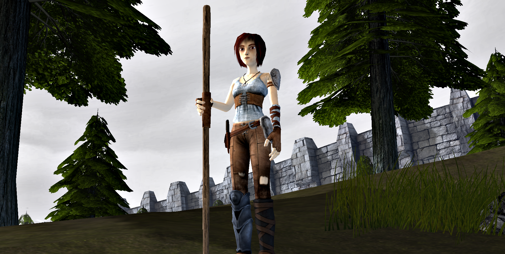

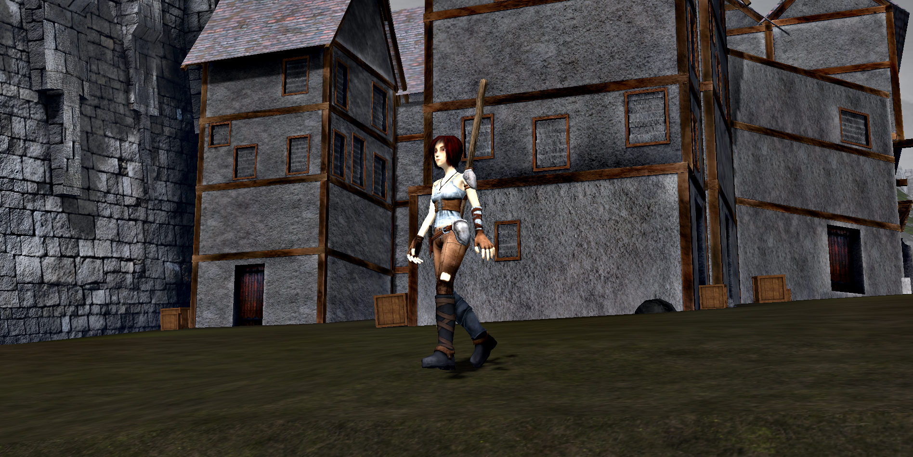

_Sintel_ is Blender Institute's third open movie project, after _Elephants Dream_ and _Big Buck Bunny.__Sintel_, like its predecessors, is unique because all the production files used in the film were released under a Creative Commons License. This encourages remixing and reusing of the character, storyline, and the asset files. _Sintel The Game_ takes advantage of this by taking story inspirations and characters from the movie. It is an adventure role-playing game that is set in the Sintel universe.

The development team consists of five main developers, with additional contributions from many artists, including David Revoy, the art directory for Sintel. The dedication of these Blender hobbyist and encouragement from many supporters has kept the project going. _Sintel The Game_ is still under development.

The team gives a behind-the-scenes look at how they are doing:

"We all know each other from working on other Blender-related endeavors and game projects. During the summer of 2009, we were looking to start a new game project. Then the Blender Foundation announced Sintel, and we decided to jump into it. We started writing a script and throwing ideas around in September of 2009. Our team works on _Sintel The Game_ in our free time (as most of us are attending college and  another is in the Air Force). We collaborate via the Internet. It's like a hobby project. This method of development is easier to work around, but makes it pretty difficult to meet deadlines. Unfortunately, the unpredictable nature of our working schedule also means that dates can rarely be set for development milestones, such as release dates.

As well as support from the Blender community, we have also received offers of help from individuals and groups who have been able to enhance or fill in gaps that our core team is not well versed in. For instance, Philippe Rey has create some fantastic and immersive music for the game; and a group called Digital Bard are working with us to bring our characters to life by contributing voice talent.

We are using models and textures from the movie. Although not every model and texture is game ready (due to the high level of detail), there are plenty of useful assets. Not only does this take a load off our shoulders, but it also makes use of the open source nature of the film.

The original decision was to use the Blender 2.4 Game Engine. Everyone on the team was more familiar with Blender 2.4. However, after testing the new Blender builds, the many new features that 2.5 could bring to the table proved irresistible. Initial tests of running the game in 2.5 went surprisingly well. No major changes were needed for the code to run with the new Blender API.

Even though the game engine does suffer from limitations, it is always improving. There are many small improvements in the new 2.5 engine that make game production in Blender less daunting. For example, logic bricks now updates when you change the name of an object, and a drop-down menu shows you a nice list of all the available objects, properties, and scripts. It's small helpful features like these that are turning the Blender Game Engine into a fantastic beginner's tool.

The development team of _Sintel The Game_ is not affiliated with the Blender Institute. _Sintel The Game_ is still under development. You can watch their progress, support them, or contribute at _http://sintelgame.org/._

## CAVE

Jorge Gascón Pérez

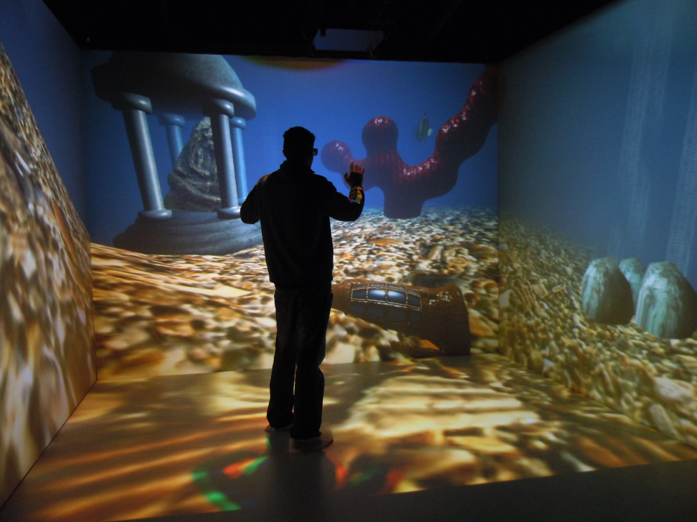

CAVE stands for Cave Automatic Virtual Environment, and it is a cubical room where all the ceiling, floor, and walls are screens. Used for virtual reality applications, a participant standing in a CAVE would be completely surrounded by projected images. Each wall shows the image cast by a video projector, and each in turn is driven by a computer. For this project, the game engine is used to create the virtual reality world displayed by the CAVE. However, unlike most virtual reality applications where the display is a single screen, the CAVE is made up of many screens, each with a field of view of 90 degrees. So a special arrangement is required to set up the game engine to render the scene from multiple angles at the same time. In this particular installation, Jorge put together a system that allows multiple instances of Blender to run on different computers in order to provide a unique view of each wall of the CAVE. This approach requires a method to synchronize the game state across multiple computers so that the image outputted by each instance of Blender is completely synchronized with the others.

Jorge explains how Blender is used in this project:

"In our implementation, we have a Blender instance running in each computer. Each instance has loaded the same Blender scene, but each one uses a different camera as an active one. All of these instances need to communicate with each other; for that we have developed a network communication protocol in Python. The communication architecture follows the Master-Slaves approach[md]the master node is the instance that drives the front screen directly; and in addition, only this instance needs external control peripherals mouse and keyboard so far.

In order to synchronize each instance,  network protocol was developed. This protocol is event-based, which means that when the user (users) presses a key or moves the mouse, it generates one or more events that are sent to the other instances. Each instance processes all of these events using standard logic bricks.

For matching screen borders, each scene in Blender has one camera per screen, and these cameras are configured to be perpendicular to each other, and all of them are parented to the "same" virtual user. (We call it "Virtual Camera Cluster.") The user can move and look around in a first-person view with the master instance, and all the cameras are translated and rotated with it.

Although the Blender game engine has no network capabilities (yet), it is really flexible, and it allows the use of complex Python scripts."

BlenderCave is an ongoing research project. You can follow its progress and download source code at [_http://gmrv.es/~jgascon/BlenderCave/index.html_](http://gmrv.es/~jgascon/BlenderCave/index.html)_._

## Color Cube

Quentin Bolsée, Benoit Bolsée

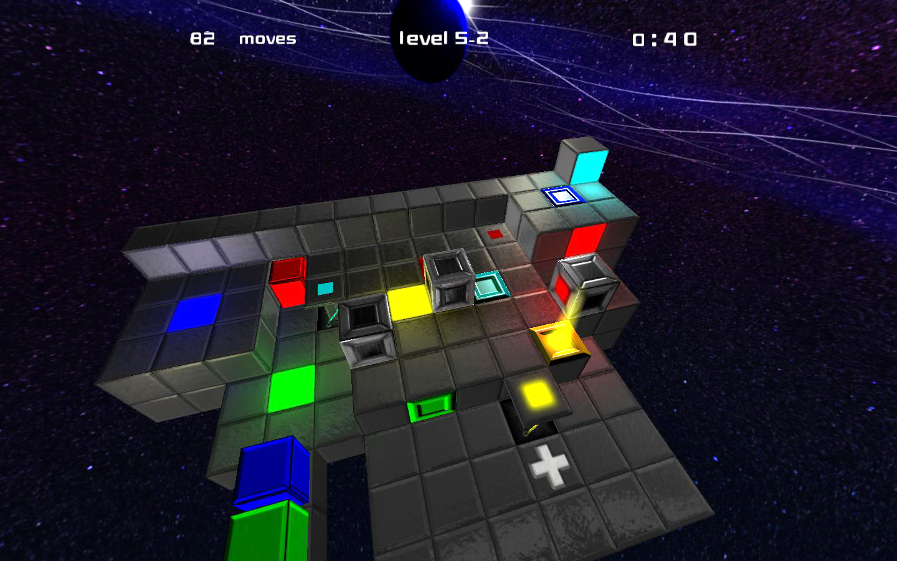

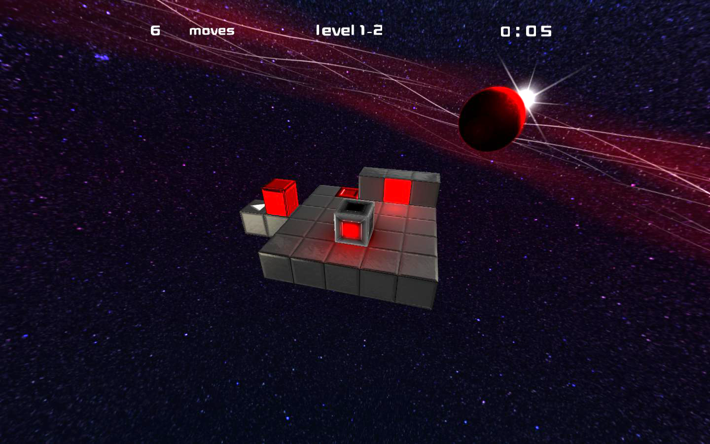

What do you get when you combine an original gameplay idea, a talented artist, and the Blender game engine? Something that might look like _Color Cube._

_ColorCube_ is an addictive puzzle game that requires the user to flip a cube onto a series of targets, while "painting" the floor underneath it with the matching color the cube picked up from elsewhere. While the game mechanics might sound confusing on paper, it's very intuitive once you see the game in action. This is a great example of a "casual game" design: the game mechanic is easy to learn, but challenging at the same time as the levels gets progressively harder.

An iPhone version of the game is also available, which uses a 3D engine written from scratch by Benoit Bolsée, who is Quentin's father, as well as an active Blender developer.

Quentin was 14-years-old when he started working on the game two years ago:

"The first version of my game was only made with Logic Bricks. It was for a competition on the BlenderArtist forum. I won second place, but a lot of people said to me that I had to make it commercial. So I did. I wanted to have a level editor, so I had to learn Python. It was complicated at first, and I needed help from my father. The new version was finished a few months after I started it. I didn't make any plan; I just worked day by day on it until it was finished. I also created a website to promote the game.

The game engine is really powerful for this kind of game. You can easily produce nice graphics using GLSL. The problem was that it's a bit slow and doesn't work on every computer, so I had to create a version of my game running without GLSL, because too many users were complaining.

Another problem with the game engine, in my opinion, was the lighting system. I had to simply give up with the shadows. And if you want to create lights during the game, you will also get into trouble. Here's the thing: adding the same light multiple times doesn't work. I had no solution for my game, because the bug is visible if you pick up the same color twice with your cube. But I suppose it's just a detail."

_Colorcube_ is available as a trial and commercial game for Windows, Mac, Linux, and iPhone from [_http://www.colorcubestudio.com/_](http://www.colorcubestudio.com/)_._

A demo version of the game is available from the accompanying online material.

## Jogo da Coleta - Recycle It 2.0

Diego Rangel

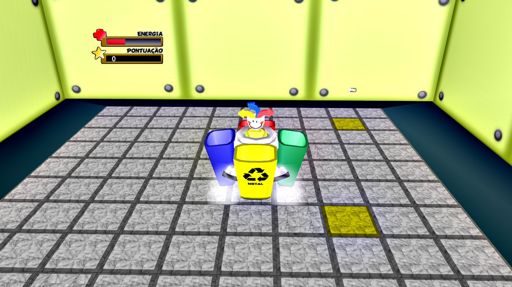

A game doesn't have to be complex or epic. There is a huge market for casual games[md]games that you can play from a smartphone or a Web browser without having to sit through endless cut scenes and cinematic storytelling. _Recyle It_ is one such game that is simple to play, but carries a strong message.

Diego explains:

"The _Recycle It_ game was initially developed as an educational tool for the project "Ambientação"[md]conceived by the state of Minas Gerais in Brazil. The goal of this game project was to raise environmental awareness of the workers in governmental buildings regarding the recycling procedures.

The game had as its primary goal to collect the maximum amount of recyclable garbage by using the correct trash cans. (In Brazil. the different recyclable materials are collected in bins with a specific color code.) In order to achieve that, the player must use mouse clicking and movement to translate and rotate the recycle bins into place to catch the falling objects.

This new version is an upgrade over the original one developed as a personal project. It's a complete revamp with new models and a different dynamic to make it more entertaining. Despite the refactoring, the game maintains the same goal: to collect garbage using the recycle bins properly.

The game contains only one single level, which gets harder as more garbage is correctly collected. When the player fails to collect the garbage (or puts it into the wrong bin), its energy decreases. When the energy ends, the game is over and hopefully a new record is set.

All the gameplay logic was planned ahead of the modeling and programming stages. This helped a lot, since it avoided drastic changes later in the development process. The production time, from its conception to the final game, took no more than a week. The speed was due to the size of the project, which spared me from doing highpoly artwork and complex programming[md]and because Blender is great software for quick prototyping and development of small projects.

During the course of this game development, the Blender game engine met all my requirements. The logic brick system allowed for quick implementation of ideas. Furthermore, the speed gain from having the game engine integrated with a full asset creation package (for example, Blender itself) was wonderful. The Blender game engine fulfilled its duties for this project. It seemed especially attractive for small and medium projects, in particular for one-man projects like this."

## World Cup Stadiums

Chico Ortiz, Yorik van Havre, Maíra Zasso

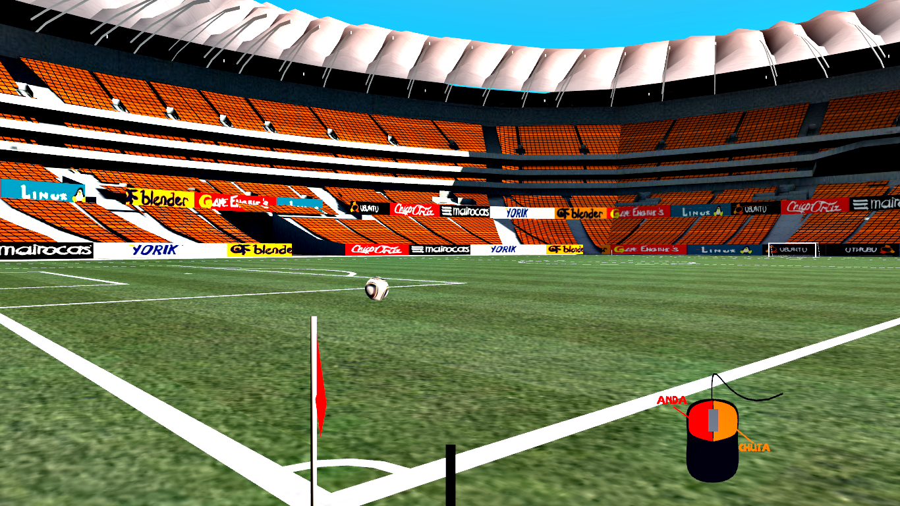

_World Cup Stadium_ is a project that used Blender to create an interactive showcase of the sports venues at the 2010 World Cup. The interactive kiosk allows people to explore the different football stadiums and their surroundings using just a mouse. Furthermore, you can view the stadium from the perspective of the field, a view that most of us rarely have an opportunity to experience in real life. Two kiosks were installed at a Brazilian Cultural Center in São Paulo, Brazil during the game.

Chico writes:

"During South Africa's 2010 World Cup, we were asked to deliver an installation for the SESC Cultural Center in São Paulo, Brazil. The initial idea was to make real models using rapid prototyping. But our client then reached the conclusion that they didn't have a site to store the models after the exhibit was over. So we ended up doing a real-time, virtual reality version of the installation using Blender.

One of the main goals of this project was to make an application that worked using only a mouse. Furthermore, we needed to consider that this piece was not meant to be seen in a personal computer but in a public space. That required care to be taken so that users couldn't shut down the file using the mouse, and the game needed to reset if there was nobody using it.

Considering our time budget of only two months, we decided to create something that visually resembled the old school 3D arcade of our childhood: 'Daytona USA' by Sega. By forfeiting photorealistic graphics, it made the application look cleaner, and gave us more time to focus on the interaction and other aspects of the game. Also, due to time constraints, we decided to run the game directly in Blender instead of using the Blenderplayer binary because there wasn't enough time to track down and resolve the differences between the two.

We are really grateful to the Open Source and Creative Commons communities. It would be untrue to say that our crew was only five persons strong. All Blender coders were part of our crew, because without their contribution, this project would not have been possible."

Chico, Maíra, and Yorik are all architects who are big fans of open-source software, and they have a long history of using Blender for their work. Maíra and Yorik's work can be seen at [_http://www.uncreated.net_](http://www.uncreated.net)_._

The original project was made in Blender 2.49, but was ported to Blender 2.5 later. More information on this project is available from: [_http://yorik.uncreated.net/guestblog.php?2010=89_](http://yorik.uncreated.net/guestblog.php?2010=89)_._

## OceanViz

Dalai Felinto, Mike Pan, Stephen Danic

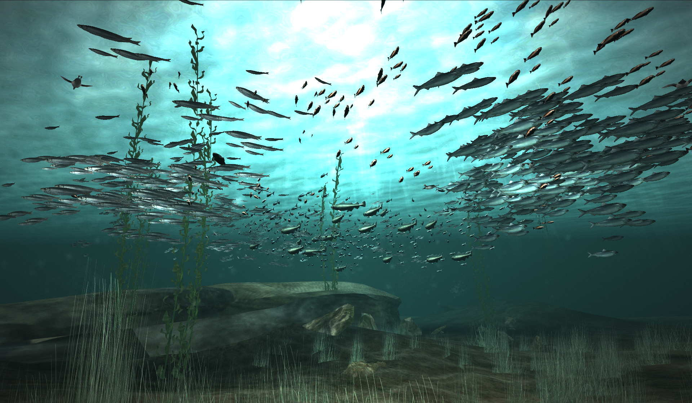

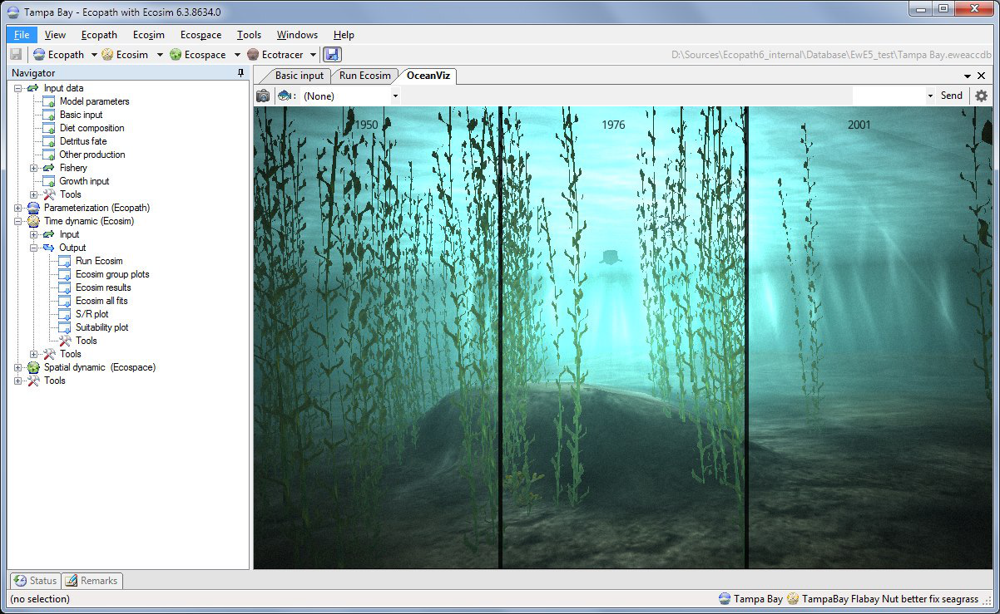
_OceanViz_ [c] UBC Fisheries Centre; EwE plug-in Jeroen Steenbeek and Dalai Felinto

Blender was used extensively at the Fisheries Centre at the University of British Columbia as a visualization and media production tool. Using 3D visualization to aid in the display of scientific data at Fisheries Centre was first implemented by a small team of artists led by Stephen Danic from the Centre for Digital Media in Vancouver. Both authors of this book got involved in the project later on, and worked to produce a number of short films and interactive applications over the past four years.

Mike explains the project:

"The first project, nicknamed _OceanViz_, is an interactive underwater visualization made with the Blender game engine. The goal of this visualization was to accurately display the amount of marine life in the sea, based on a scientific modeling program called _Ecopath with Ecosim (EwE)_. EwE would use a set of user-defined input to interpolate and predict the future. By playing the 'what-if' game, scientists and policy makers could test out different scenarios and see how their decisions today would impact tomorrow's oceans. A large portion of this project focused on the 3D visualization, which is what the users will ultimately be seeing. By replacing complex data and charts with realistic animated underwater scenes, users will be better able to appreciate the impact of their decisions.

The development of the visualization spans over two years, and we started the project with Blender 2.46 and eventually ported the visualization to Blender 2.5. Python was used extensively to drive the entire visualization, and it was responsible for populating the virtual world with fishes, controlling their movements, and handling all of the user-inputs.

One of the biggest roadblocks for _OceanViz_ was balancing the performance and realism of the visualization. As it turns out, the Blender game engine was not very well optimized for rendering a large number of objects. Framerate would drop sharply as the number of objects on the screen increased. To assign each fish its own intelligence routine would undoubtedly lead to better behavior, but at the cost of much higher computation requirements. A compromise was reached by joining a large number of fishes into one object, thus reducing the need to control individual objects separately. This worked out surprisingly well. When there is a large school of fish, it is almost impossible to tell that the fishes are, in fact, batched together.

The _OceanViz_ project was presented at the 2008 Blender conference; sample files and slides are available from [_http://www.blender.org/community/blender-conference/blender-conference-2008/proceedings/_](http://www.blender.org/community/blender-conference/blender-conference-2008/proceedings/)_._

In its current iteration, _OceanViz_ is implemented as a plug-in for the Ecopath with Ecosim (EwE) desktop software, using the embedding capabilities of the Blenderplayer.

The _OceanViz_ project was conceived by professor Dr. Villy Christensen. The EwE development team that supports the _OceanViz_ consists of Jeroen Steenbeek and Joe Buszowski, with past support from Sherman Lai and Sundaran Kumar.

## Cosmic Sensation

Dalai Felinto, Martins Upitis, Mike Pan

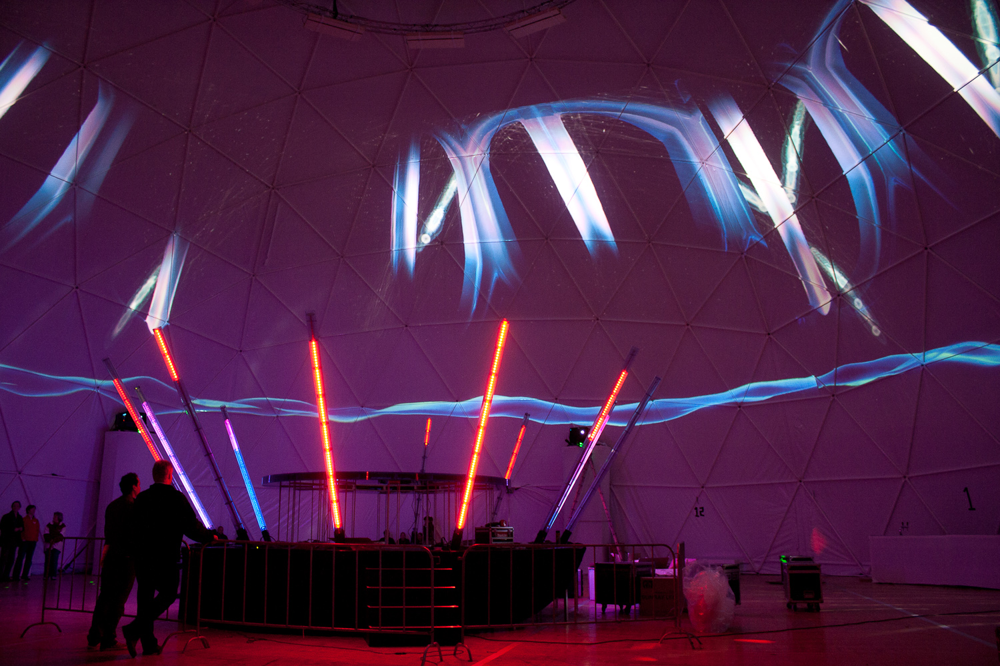

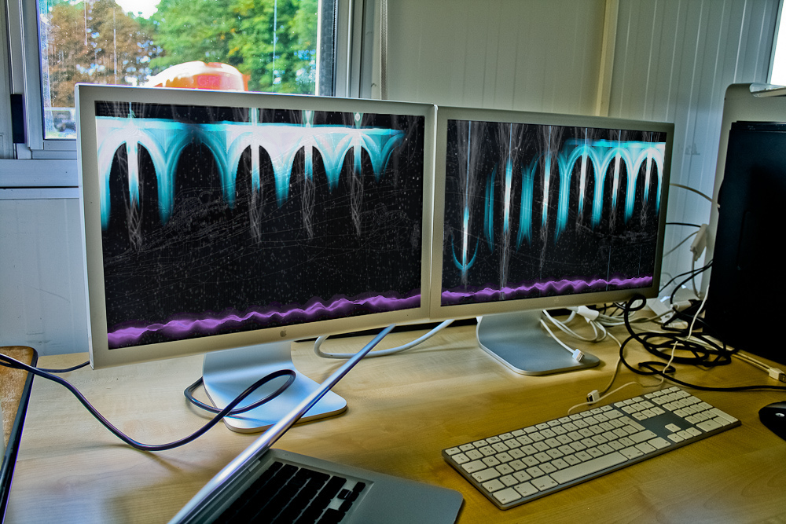

Somewhere in the Netherlands, there was a Blender project that involved cosmic particles detectors, a 30-meter tall immersive dome, a three-day party with Euro-disco music, and lots of beer. We worked on that project.

Every second, billions of harmless muon particles from outer space bombard the earth. Using particle detectors developed at Radboud University in Nijmegen, we were able to use this inflow of particles to drive an immersive audio-visual experience inside a 30-meter tall immersive dome installation. The event used Blender to generate real-time graphics of the muon particles hitting the sensor, and it painted the entire dome using six high-power projectors using visualizations generated in real-time by Blender. Thanks to our team's familiarity with Blender, the game engine turned out to be the perfect tool for us to use for a generative graphics art installation like this.

Mike recalls:

"Being the mastermind behind the project, Dalai brought Martins and me on board the project. We arrived on location 10 days prior to the event and started working. The goal was to create real-time visualizations that were driven by an external "beat"[md]the muon particles. The challenge was the massive size of the display. Instead of a typical flat TV screen that is usually less than a meter across, the graphics would be displayed on the inside of a 30-meter hemisphere that had a total resolution of 3840 x 1080 pixels.

We wanted to create artwork in a Tron-like style, with a dark background and glossy glass, accented by colorful neons. Armed with only a vague concept of what we wanted to create, we started experimenting. The resulting visualization can be seen in the photos above.

While Martins and I worked on the artwork, Dalai was busy patching the game engine's dome mode to support the projection mapping required. To output a 360-degree panorama of the scene to the projectors, it involved making Blender render the scene from multiple angles of each frame, stitching them together to form one massive image, and then wrapping the image to fit the projection mapping required by the projection software. It was a rather complex task that involved some mind-bending math and  a good knowledge of the GPU.  The task was further exacerbated by the lack of time and the strict performance requirement[md]after all, we didn't want the framerate of the visualization to drop anywhere below 30fps.

One technical limitation that hindered our creativity was that we had to keep the visualization dark[md]because if a bright image were projected onto one side of the dome, white light would reflect off the screen and light up the other side. This reduced the contrast of the overall projected image in the dome. (This is exactly the same reason why a movie theater is kept dark.)  So in order to keep the ambient light level to a minimum, we had to make the visualization black-dominant and be careful to use only brighter areas sparingly. This ensured that we always had a good, high-contrast image.

With two days left, and the main visualization completed, we started considering other "fun" stuff to make. What better way to show off a huge dome than to play a classic game of _Breakout_ on it? Using the incoming cosmic particles as projectiles, they would fire down from above to slowly destroy the rotating bricks' layers. From inception to finish, it took us less than a day to create the game.

During those 10 days, there were a lot of sleepless nights and way too many energy drinks. But in the end, we pulled of a wonderful show, and had fun while doing it.  Isn't that what it's all about?

The Cosmic Sensation project was an initiative of professor Dr. Sijbrand de Jong from the Radboud University along with Barney Broomer, producer and full-dome specialist.

Videos, photos and description of the event can be found at _http://www.dalaifelinto.com/?page_id=445_.
